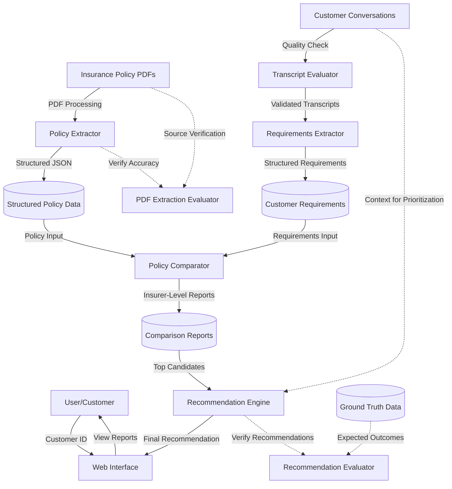

# Revolutionizing Travel Insurance: An LLM-Powered Recommendation Workflow

Navigating the complexities of travel insurance is a major consumer headache, leading to confusion and suboptimal choices.  

This project tackles that challenge head-on with an intelligent workflow powered by Large Language Models (LLMs). We automate the heavy lifting – extracting critical data from dense policy documents and simulated customer interactions – enabling rapid, data-driven comparison and the generation of personalized, justified recommendations. 

This README outlines the workflow consisting of structured data extraction, automated analysis, and rigorous evaluation which unlocks unprecedented efficiency and transparency in insurance selection, paving the way for smarter, unbiased, and transparent recommendations.

## System Overview



## Getting Started

Follow these steps to set up the project environment:

1.  **Clone the Repository**:
    ```bash
    git clone <repository_url>
    cd mtech-policy-recsys
    ```
    *(Replace `<repository_url>` with the actual URL)*

2.  **Set Up Python Environment**:
    It's recommended to use a virtual environment:
    ```bash
    python -m venv venv
    source venv/bin/activate  # On Windows use `venv\Scripts\activate`
    ```
    Install Python dependencies for the core backend scripts and logic:
    ```bash
    pip install -r requirements.txt
    ```

3.  **Set Up API Keys**:
    Create a `.env` file in the project root and add your API keys required for LLM interactions:
    ```dotenv
    GOOGLE_API_KEY="your_google_api_key_here"
    OPENAI_API_KEY="your_openai_api_key_here"
    # OPENAI_MODEL_NAME="gpt-4o" # Optional: Defaults to gpt-4o if not set for CrewAI/Extractor
    ```

4.  **Install Node.js Dependencies (for Frontend)**:
    This project includes a frontend web application component located in the `ux-webapp/` directory. To set up the frontend, navigate to that directory and install the required Node.js dependencies:
    ```bash
    cd ux-webapp
    npm install
    cd ..
    ```
    *Note: Ensure you have Node.js and npm installed. This step is necessary to run the web interface.*

## User-Friendly Web Interface

This project includes a modern, easy-to-use web application that makes exploring insurance recommendations simple:

- **Simple Login**: Enter your customer ID to access your personalized reports
- **Intuitive Navigation**: Browse different sections of your recommendation through a familiar tab-based interface
- **Interactive Features**:
  - View your personalized recommendation with clear justifications
  - Compare different insurance policies side-by-side
  - Review your original conversation
  - Provide feedback on recommendations
- **Mobile-Friendly**: Access your recommendations on any device

### Running the Web Interface

1. **Start the Development Server**:
   ```bash
   cd ux-webapp
   npm run dev
   ```
   Then open your browser to the displayed URL (typically http://localhost:5173)

2. **Build for Production** (optional):
   ```bash
   cd ux-webapp
   npm run build
   ```
   This creates optimized files in the `ux-webapp/dist` directory.

### Online Access

The web application is deployed and accessible online at:
[https://aegis-recsys.netlify.app/](https://aegis-recsys.netlify.app/)

You can use this link to explore the interface and functionality without installing the project locally.

## Key Features

**1. Data Generation & Processing:**
- **Synthetic Transcript Generation**: Creates realistic, scenario-driven customer conversations using LLMs, incorporating personalities and specific coverage requirements.
- **Automated Policy Extraction**: Uses LLMs to parse policy PDFs, extracting tier-specific coverage into structured JSON, including base/conditional limits and source-linked details.
- **Structured Requirement Extraction**: Employs an AI agent (using the CrewAI framework) to analyze transcripts and convert customer needs into validated, structured JSON based on a predefined schema.

**2. Analysis & Recommendation:**
- **Insurer-Level Policy Comparison**: Generates Markdown reports via LLMs comparing customer requirements against all policy tiers for an insurer, recommending the best-fit tier with justification and detailed coverage analysis.
- **Final Recommendation Report Generation**: Processes comparison reports, applies scoring, uses an LLM for re-ranking, and generates a final customer-friendly Markdown recommendation report.

**3. Evaluation & Quality Assurance:**
- **LLM-Based Transcript Evaluation**: Assesses generated transcripts for requirement coverage completeness (standard and scenario-specific) using LLMs, providing JSON results with quote-based justifications.
- **PDF Extraction Evaluation**: Compares processed policy JSON against the source PDF using a multi-modal LLM to verify extraction accuracy and completeness.
- **Ground Truth Recommendation Evaluation**: Compares final recommendations against a curated ground truth dataset (`data/ground_truth/ground_truth.json`) using semantic matching (`src/embedding/embedding_utils.py`) to assess accuracy for specific scenarios.

**4. Future Goals:**
- **(Planned) Iterative Refinement**: Future goal for users to update needs and receive refined recommendations.

## Command-Line Usage

This section outlines the key commands available for running different parts of the system.

### Data Generation and Processing

1. **Extract Policy Data**:
   ```bash
   # Process a specific policy PDF
   python scripts/extract_policy_tier.py --pdf_path data/policies/raw/fwd_Premium.pdf --output_dir data/policies/processed/

   # Process all policy PDFs in the raw directory
   python scripts/extract_policy_tier.py
   ```

2. **Generate Personalities** (optional):
   ```bash
   python scripts/data_generation/generate_personalities.py
   ```

3. **Generate Synthetic Transcripts**:
   ```bash
   # Generate 5 general transcripts
   python scripts/data_generation/generate_transcripts.py -n 5

   # Generate 3 transcripts for a specific scenario (e.g., golf coverage)
   python scripts/data_generation/generate_transcripts.py -n 3 -s golf_coverage
   ```
   Available scenarios: `golf_coverage`, `pet_care_coverage`, `public_transport_double_cover`, `uncovered_cancellation_reason`

4. **Evaluate Transcripts**:
   ```bash
   # Evaluate a single transcript
   python scripts/evaluation/transcript_evaluation/eval_transcript_main.py --transcript data/transcripts/raw/synthetic/transcript_golf_coverage_6aef8846-aed1-4a6e-8115-d5ca7d6d0abf.json

   # Evaluate all transcripts in a directory
   python scripts/evaluation/transcript_evaluation/eval_transcript_main.py --directory data/transcripts/raw/synthetic/
   ```

5. **Parse Transcripts**:
   ```bash
   python src/utils/transcript_processing.py
   ```

6. **Extract Requirements**:
   ```bash
   python src/agents/extractor.py
   ```

### Analysis and Recommendation

7. **Generate Policy Comparison Reports**:
   ```bash
   # Generate comparison reports for a specific customer
   python scripts/generate_policy_comparison.py --customer_id 49eb20af-32b0-46e0-a14e-0dbe3e3c6e73
   ```

8. **Generate Final Recommendation**:
   ```bash
   # Generate recommendation for a specific customer
   python scripts/generate_recommendation_report.py --customer_id 49eb20af-32b0-46e0-a14e-0dbe3e3c6e73

   # Force overwrite of existing recommendation
   python scripts/generate_recommendation_report.py --customer_id 49eb20af-32b0-46e0-a14e-0dbe3e3c6e73 --overwrite
   ```

### Evaluation Tools

9. **Evaluate PDF Extraction**:
   ```bash
   # Evaluate all processed policy JSON files
   python scripts/evaluation/pdf_extraction_evaluation/eval_pdf_extraction.py

   # Evaluate only specific policies (using file pattern)
   python scripts/evaluation/pdf_extraction_evaluation/eval_pdf_extraction.py --file_pattern "fwd_*.json"
   ```

10. **Evaluate Recommendations**:
    ```bash
    # Evaluate recommendations for a specific scenario
    python scripts/evaluation/scenario_evaluation/evaluate_scenario_recommendations.py --scenario golf_coverage

    # Evaluate recommendations for all scenarios
    python scripts/evaluation/scenario_evaluation/evaluate_scenario_recommendations.py
    ```

11. **Calculate Pass Rates**:
    ```bash
    python scripts/calculate_scenario_pass_rates.py
    ```

### End-to-End Workflow (Orchestrator)

12. **Run Complete Pipeline**:
    The `scripts/orchestrate_scenario_evaluation.py` script automates the entire workflow from transcript generation to final evaluation for target scenarios.
    ```bash
    # Run the full workflow with 5 transcripts per scenario
    python scripts/orchestrate_scenario_evaluation.py -n 5

    # Skip transcript evaluation for faster processing
    python scripts/orchestrate_scenario_evaluation.py -n 5 --skip_transcript_eval

    # Only run the final evaluation step on existing results
    python scripts/orchestrate_scenario_evaluation.py --only_aggregate
    ```
    *   **Arguments**:
        *   `-n`, `--num_transcripts`: Number of transcripts per scenario (default: 5).
        *   `--skip_transcript_eval`: Skips initial transcript evaluation.
        *   `--only_aggregate`: Skips generation/processing, only runs final evaluation.
    *   **Output**: Creates intermediate files and final reports. Aggregated scenario evaluation results are saved in `data/evaluation/scenario_evaluation/`.

## Specialized Travel Scenarios

The system is designed to handle specific travel situations including:

- **Golf Trips**: Coverage for equipment, green fees, and other golf-specific needs
- **Pet Owners**: Options for pet accommodation if your return is delayed
- **Public Transport**: Enhanced coverage when traveling on public transportation
- **Special Events**: Coverage for trip cancellation due to important personal events

These scenarios can be selected when generating test data to see how the system handles specific travel needs. Use the `-s` flag with the `generate_transcripts.py` script to specify a scenario:

```bash
# Example: Generate 3 transcripts for golf coverage scenario
python scripts/data_generation/generate_transcripts.py -n 3 -s golf_coverage
```

## Technical Stack

- **Python**: Primary programming language for backend logic and data processing.
- **Google Gemini & OpenAI**: Large Language Models used for various tasks like data generation, extraction, comparison, and evaluation.
- **CrewAI**: Framework used for the requirement extraction agent.
- **React & Material UI**: Used for building the frontend web application.
- **Pydantic**: Used for data validation and defining structured schemas.
- **NLTK**: Used for text preprocessing in embedding utilities.

## Future Enhancements

The current system provides a robust foundation. Future work could include:

- **Functional Feedback System**: Implementing the backend logic to actually collect and process user feedback submitted through the web interface.
- **Comparison Report Evaluation**: Adding automated evaluation for the quality and accuracy of the generated policy comparison reports.
- **Advanced Orchestration**: Developing a more sophisticated workflow management system beyond the current script-based orchestration.
- **Machine Learning Insights**: Training ML models on the generated data (requirements, recommendations) to uncover deeper insights.
- **Iterative Refinement**: Allowing users to update their needs within the web interface and receive refined recommendations.

## Academic Project

This is an academic project focused on applying AI and LLM techniques to solve real-world problems in the insurance domain.
