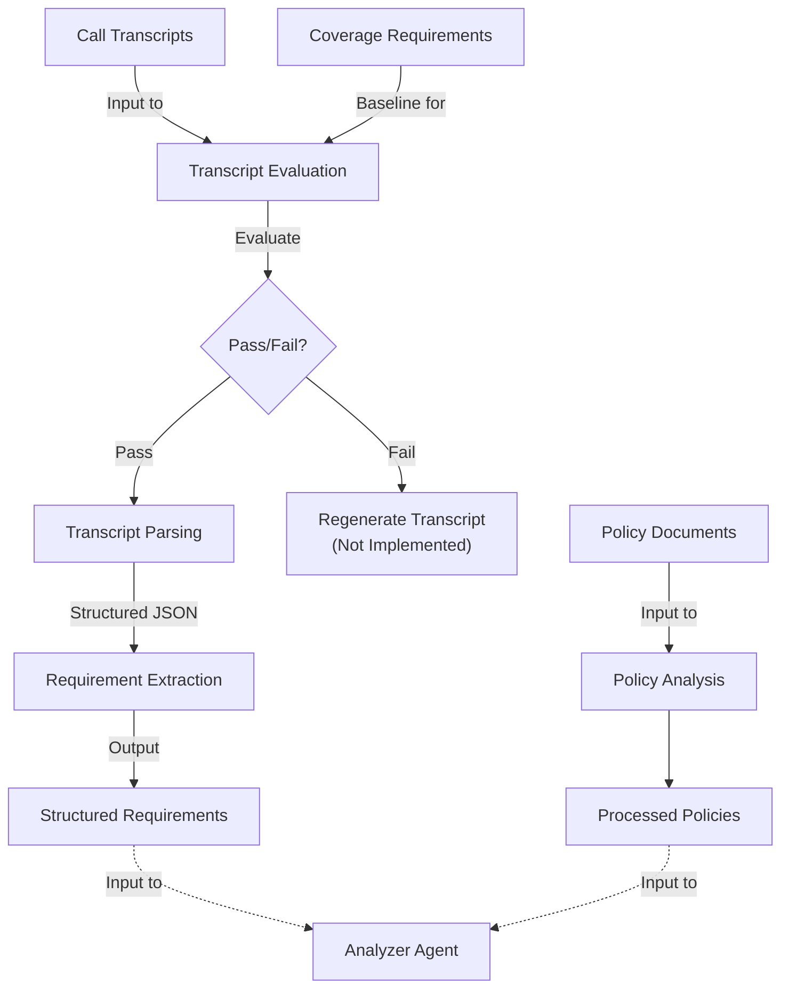

# Multi-Agent System for Insurance Policy Recommendations

A multi-agent system that transforms the complex process of buying travel insurance into a simple, personalized, and transparent experience.

## Project Overview

This system addresses common pain points in insurance purchasing by providing personalized, transparent, and objective recommendations through a conversational interface.

### Key Features

- **Conversational Interface**: Natural interaction with a Customer Service agent
- **Personalized Analysis**: Tailored recommendations based on individual needs
- **Multi-Agent Voting**: Consensus-based recommendations for increased reliability
- **Transparent Justifications**: Clear explanations linked to policy clauses
- **Iterative Refinement**: Ability to update requirements and receive new recommendations

# How To Use

## Transcript Processing and Requirement Extraction Workflow



**Explanation:**

1.  **Inputs:** The workflow starts with Raw Call Transcripts (from `data/transcripts/raw/`) and the defined Coverage Requirements (from `data/coverage_requirements/coverage_requirements.py`).
2.  **Evaluation:** The `scripts/evaluation/eval_transcript_main.py` script automatically evaluates the transcript against the coverage requirements.
3.  **Decision:**
    *   If the evaluation **passes**, the transcript proceeds to the processing stage.
    *   If it **fails**, the ideal next step (currently not implemented) would be to regenerate or revise the transcript.
4.  **Processing & Extraction:**
    *   Passed transcripts undergo an initial parsing step (potentially using logic from `src/utils/transcript_processing.py` or another process) to prepare them.
    *   The `src/agents/extractor.py` agent then consumes these parsed transcripts and extracts the final structured requirements into a JSON object conforming to the `TravelInsuranceRequirement` model (defined in `src/utils/transcript_processing.py`).
5.  **Output:** The result is a structured JSON file containing the extracted customer requirements (e.g., `insurance_requirement.json`).

## Policy Data Workflow

1.  **Input**: Raw insurance policy documents in PDF format are stored in the `data/policies/raw/` directory. Files must follow the naming convention `insurer_{policy_tier}.pdf` (e.g., `allianz_{gold_plan}.pdf`).
2.  **Processing**: The `scripts/extract_policy_tier.py` script processes these PDFs. It uses the Google Gemini API to extract detailed coverage information for the specific policy tier indicated in the filename. The script validates the output against a predefined Pydantic schema.
3.  **Output**: Structured JSON files, named `insurer_{policy_tier}.json`, are saved in the `data/policies/processed/` directory. Each file contains the extracted coverage details for a specific policy tier.
4.  **Usage**: This structured JSON policy data is the primary input for the Analyzer Agent, enabling it to compare customer requirements against detailed, validated policy information.


# Project Structure

```
/
├── memory-bank/             # Cline's memory bank
├── notebooks/               # Jupyter notebooks for experimentation
│   ├── exploratory/         # Initial data exploration
│   ├── agent_development/   # Agent-specific experiments
│   │   └── extractor/       # Requirement extraction from transcripts
│   ├── integration/         # Testing agent interactions
│   ├── evaluation/          # Performance metrics
│   └── pdf_parsing/         # PDF to text conversion utilities
├── data/                    # Data storage
│   ├── coverage_requirements/ # Standardized coverage requirements
│   ├── policies/            # Insurance policy documents
│   │   ├── raw/             # Original PDF policy documents
│   │   └── processed/       # Processed text policy documents
│   ├── transcripts/         # Conversation transcripts
│   │   ├── raw/             # Original conversation transcripts
│   │   └── processed/       # Processed JSON transcripts
├── src/                     # Source code
│   ├── agents/              # Agent implementations
│   ├── models/              # LLM configurations and services
│   ├── prompts/             # Prompts for LLM tasks
│   ├── utils/               # Utility functions
│   │   └── transcript_processing.py # Transcript parsing utilities
│   └── web/                 # Web interface components
├── tests/                   # Test cases
├── scripts/                 # Utility scripts
│   └── evaluation/          # Transcript evaluation scripts
└── tutorials/               # Tutorial scripts and examples
```

## Key Workflow Components

The project structure supports the workflow illustrated in the diagram above:

1. **Data Inputs**
   - **Policy Documents**: Located in `data/policies/raw/` (PDF format)
   - **Call Transcripts**: Located in `data/transcripts/raw/` (text format)
   - **Coverage Requirements**: Defined in `data/coverage_requirements/coverage_requirements.py`

2. **Transcript Evaluation**
   - **Component**: `scripts/evaluation/eval_transcript_main.py`
   - **Purpose**: Evaluates if transcripts contain all required coverage information
   - **Output**: Pass/fail decision for each transcript

3. **Transcript Processing**
   - **Component**: `src/utils/transcript_processing.py`
   - **Purpose**: Parses raw transcripts into structured JSON format
   - **Output**: JSON files in `data/transcripts/processed/`

4. **Requirement Extraction**
   - **Component**: `src/agents/extractor.py`
   - **Purpose**: Extracts structured customer requirements from parsed transcripts using a dedicated agent.
    - **Output**: Structured requirements JSON (e.g., `insurance_requirement.json`), conforming to the `TravelInsuranceRequirement` model.

5. **Policy Processing**
   - **Component**: `scripts/extract_policy_tier.py`
   - **Purpose**: Extracts structured coverage details from policy PDFs using Gemini API for a specific policy tier.
   - **Input**: PDFs from `data/policies/raw/` named `insurer_{policy_tier}.pdf`.
   - **Output**: Structured JSON policy data in `data/policies/processed/` named `insurer_{policy_tier}.json`.

## Technical Stack

- **Python**: Primary programming language
- **Google Gemini**: LLM for natural language processing
- **Jupyter Notebooks**: Development environment
- **LLM Service**: Reusable interface to Google Gemini API

## Components

### LLM Service

The project includes a reusable LLM service that provides a unified interface to the Google Gemini API:

- **Configuration**: Environment-based configuration with support for different models and parameter sets
- **Features**: Content generation, structured output (JSON), streaming responses, batch processing
- **Error Handling**: Retry logic, validation, and comprehensive error management
- **Tutorial**: Example usage in `tutorials/llm_service_tutorial.py`

## Getting Started

1. Clone the repository
2. Install dependencies: `pip install -r requirements.txt`
3. Set up your Google Gemini API key:
   ```
   # In .env file or environment variables
   GOOGLE_API_KEY=your_api_key_here
   ```
4. Explore the notebooks in the `notebooks/` directory
5. Check out the LLM service tutorial: `python tutorials/llm_service_tutorial.py`

## Academic Project

This is an academic project focused on applying multi-agent AI systems to solve real-world problems in the insurance domain.
