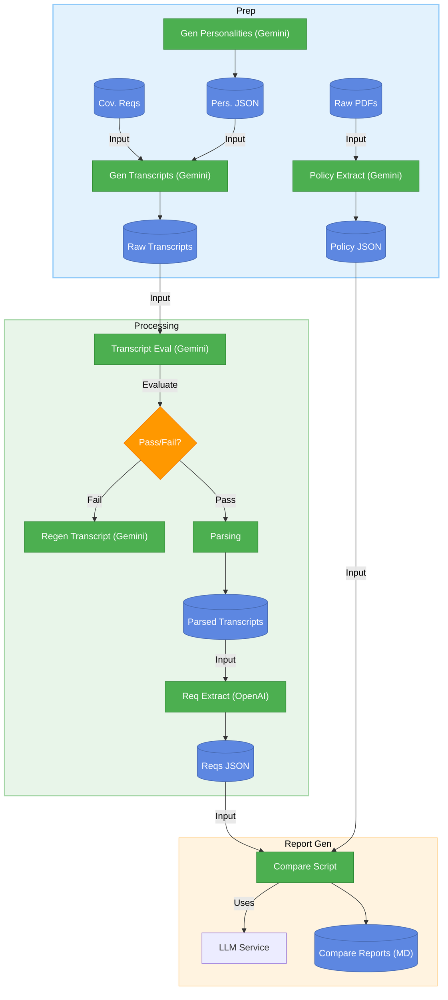

# Multi-Agent System for Insurance Policy Recommendations

A multi-agent system that transforms the complex process of buying travel insurance into a simple, personalized, and transparent experience.

## Project Overview

This system addresses common pain points in insurance purchasing by providing personalized, transparent, and objective recommendations through a conversational interface.

### Key Features

- **Conversational Interface**: Natural interaction with a Customer Service agent
- **Personalized Analysis**: Tailored recommendations based on individual needs
- **Multi-Agent Voting**: Consensus-based recommendations for increased reliability
- **Transparent Justifications**: Clear explanations linked to policy clauses
- **Iterative Refinement**: Ability to update requirements and receive new recommendations

## How To Use

This section outlines the primary workflows for preparing data, processing transcripts, and generating comparison reports within the system.



## 1. Data Preparation

This phase involves processing raw policy documents and generating synthetic transcript data.

### Policy Data Workflow

1.  **Input**: Place raw insurance policy documents in PDF format into the `data/policies/raw/` directory. Ensure files follow the naming convention `insurer_{policy_tier}.pdf` (e.g., `allianz_{gold_plan}.pdf`).
2.  **Processing**: Run the `scripts/extract_policy_tier.py` script. This script uses the Google Gemini API to extract detailed coverage information for the specific policy tier indicated in the filename and validates the output against a Pydantic schema.
    ```bash
    python scripts/extract_policy_tier.py
    ```
3.  **Output**: Structured JSON files, named `insurer_{policy_tier}.json`, are saved in the `data/policies/processed/` directory.
4.  **Usage**: This structured policy data is used later by the Analyzer Agent.

### Synthetic Transcript Workflow

1.  **Generate Personalities (Optional)**: If `data/transcripts/personalities.json` doesn't exist or needs updating, run:
    ```bash
    python scripts/data_generation/generate_personalities.py
    ```
    This script uses the Gemini API to generate a list of common customer personalities and saves them.
2.  **Generate Transcripts**: Run the `scripts/data_generation/generate_transcripts.py` script. This script uses the generated personalities (`personalities.json`), the defined coverage requirements (`data/coverage_requirements/coverage_requirements.py`), and the Gemini API to create synthetic conversation transcripts.
    ```bash
    # Generate 5 transcripts
    python scripts/data_generation/generate_transcripts.py -n 5
    ```
3.  **Output**: Structured, timestamped JSON transcript files (e.g., `transcript_the_skeptic_20250403_151200.json`) are saved in `data/transcripts/raw/synthetic/`. Each file contains the personality used and the conversation structured as speaker turns.

## 2. Transcript Processing and Requirement Extraction

This phase focuses on evaluating the generated transcripts and extracting customer requirements.

1.  **Evaluation**: Run the `scripts/evaluation/eval_transcript_main.py` script to automatically evaluate the raw synthetic transcripts (`data/transcripts/raw/synthetic/`) against the defined coverage requirements (`data/coverage_requirements/coverage_requirements.py`).
    ```bash
    python scripts/evaluation/eval_transcript_main.py
    ```
    This helps ensure the generated transcripts meet the necessary criteria before further processing. (Note: The workflow currently proceeds regardless of pass/fail, but evaluation results are generated).
2.  **Parsing (Manual/Future Step)**: Transcripts that pass evaluation (or all transcripts, depending on the desired workflow) need to be parsed into a standardized format if they aren't already structured correctly. Currently, the generation script outputs structured JSON, but if using other raw sources, this step might involve `src/utils/transcript_processing.py` or similar logic to create files in `data/transcripts/processed/`.
3.  **Requirement Extraction**: Run the `src/agents/extractor.py` script, providing the path to a *parsed* transcript JSON file (from `data/transcripts/processed/` or directly from `data/transcripts/raw/synthetic/` if the structure is compatible). This script uses a CrewAI agent (configured with OpenAI) to extract structured requirements.
    ```bash
    # Example using a generated transcript directly (assuming compatible structure)
    python src/agents/extractor.py data/transcripts/raw/synthetic/transcript_the_skeptic_20250403_151200.json
    ```
4.  **Output**: The script saves the extracted requirements as a JSON file in `data/extracted_customer_requirements/`. The filename is derived from the input transcript name (e.g., `transcript_the_skeptic_20250403_151200_requirements.json`), conforming to the `TravelInsuranceRequirement` Pydantic model.

## 3. Policy Comparison Report Generation

This step uses the structured requirements and policy data to generate detailed Markdown comparison reports for each policy against a specific customer's needs.

1.  **Input**: Requires structured requirements JSON from step 2 (`data/extracted_customer_requirements/`) and processed policy JSON files from step 1 (`data/policies/processed/`).
2.  **Processing**: Run the `scripts/generate_policy_comparison.py` script, providing the path to the specific customer requirements file you want to use.
    ```bash
    # Example using the confused novice requirements
    python scripts/generate_policy_comparison.py data/extracted_customer_requirements/requirements_the_confused_novice_20250403_175921.json
    ```
    The script uses the Gemini API (`gemini-2.5-pro-preview-03-25`) via the `LLMService` to compare the requirements against *all* policies found in `data/policies/processed/`. It processes policies asynchronously in batches.
3.  **Output**: Markdown reports are saved to a subdirectory within `results/`, named after the customer ID and timestamp from the input requirements file (e.g., `results/the_confused_novice_20250403_175921/`). Each report file is named `policy_comparison_{provider}_{tier}_{customer_id}_{timestamp}.md`.

## 4. Policy Recommendation (Future)

The outputs from the previous steps (Structured Policy JSON, Structured Requirements JSON, and potentially the generated Comparison Reports) will serve as inputs to the future Analyzer Agent, which will compare them to generate personalized policy recommendations.

## Data Pipeline Regeneration

To regenerate the core data pipeline from transcript generation through requirement extraction, follow these steps in order:

1.  **(Optional) Update Coverage Requirements**: Modify `data/coverage_requirements/coverage_requirements.py` if the standard requirements need changes.
2.  **Generate Synthetic Transcripts**: Run `python scripts/data_generation/generate_transcripts.py` (use `-n` to specify the number). This creates raw JSON transcripts in `data/transcripts/raw/synthetic/` based on defined personalities and coverage requirements.
3.  **Evaluate Raw Transcripts**: Run `python scripts/evaluation/eval_transcript_main.py --directory data/transcripts/raw/synthetic/`. This checks if the generated raw transcripts adequately cover the requirements. Results are saved in `data/evaluation/transcript_evaluations/` (by default).
4.  **Process Raw Transcripts**: Run `python src/utils/transcript_processing.py`. This script batch-processes all raw transcripts found in `data/transcripts/raw/synthetic/` and saves parsed versions (standardized JSON lists) to `data/transcripts/processed/`.
5.  **Extract Requirements**: Run `python src/agents/extractor.py`. This script batch-processes all parsed transcripts from `data/transcripts/processed/` using the Extractor Agent and saves the structured requirements (JSON) to `data/extracted_customer_requirements/`.

This sequence takes you from the initial transcript generation to having structured customer requirements ready for the downstream analysis agents.

## Project Structure

```
/
├── notebooks/                  # Jupyter notebooks for experimentation
│   ├── agent_development/      # Agent-specific experiments
│   │   ├── analyzer/           # Analyzer agent development
│   │   ├── extractor/          # Requirement extraction from transcripts
│   │   ├── recommender/        # Recommender agent development
│   │   └── voting/             # Voting system development
│   └── supervised_learning/    # Supervised learning experiments
├── data/                       # Data storage
│   ├── coverage_requirements/  # Standardized coverage requirements
│   ├── extracted_customer_requirements/ # Extracted requirements from transcripts
│   ├── policies/               # Insurance policy documents
│   │   ├── raw/                # Original PDF policy documents
│   │   └── processed/          # Processed policy JSON files
│   ├── transcripts/            # Conversation transcripts
│   │   ├── raw/                # Original conversation transcripts (synthetic/, real/)
│   │   └── processed/          # Processed JSON transcripts
│   └── evaluation/             # Evaluation data
│       └── transcript_evaluations/ # Transcript evaluation results
├── src/                        # Source code
│   ├── agents/                 # Agent implementations
│   │   ├── analyzer.py         # Policy analyzer agent
│   │   ├── cs_agent.py         # Customer service agent
│   │   ├── extractor.py        # Requirement extraction agent
│   │   ├── recommender.py      # Policy recommendation agent
│   │   └── voting.py           # Consensus voting system
│   ├── models/                 # LLM configurations and services
│   │   ├── base.py             # Base model definitions
│   │   ├── gemini_config.py    # Google Gemini configuration
│   │   └── llm_service.py      # LLM service interface
│   ├── prompts/                # Prompts for LLM tasks
│   │   └── cs_agent_prompts.py # Customer service agent prompts
│   ├── utils/                  # Utility functions
│   │   ├── email_service.py    # Email service utilities
│   │   └── transcript_processing.py # Transcript parsing utilities
│   └── web/                    # Web interface components
│       └── app.py              # Web application
├── tests/                      # Test cases
│   └── test_agents.py          # Agent tests
├── scripts/                    # Utility scripts
│   ├── extract_policy_tier.py  # Extracts policy tiers from PDF/text
│   ├── generate_policy_comparison.py # Generates Markdown comparison reports
│   ├── data_generation/        # Scripts specifically for data generation
│   │   ├── generate_personalities.py # Generates personality types
│   │   └── generate_transcripts.py   # Generates synthetic transcripts using LLM
│   └── evaluation/             # Transcript evaluation scripts
│       ├── eval_transcript_main.py # Main evaluation script
│       ├── evaluators/         # Evaluation implementations
│       ├── processors/         # Result processors
│       ├── prompts/            # Evaluation prompts
│       └── utils/              # Evaluation utilities
└── tutorials/                  # Tutorial scripts and examples
    ├── llm_service_guide.md    # LLM service documentation
    └── llm_service_tutorial.py # LLM service usage examples
```

## Key Workflow Components

The project structure supports the workflow illustrated in the diagram above:

1. **Data Inputs**
   - **Policy Documents**: Located in `data/policies/raw/` (PDF format)
   - **Call Transcripts**: Located in `data/transcripts/raw/` (text format)
   - **Coverage Requirements**: Defined in `data/coverage_requirements/coverage_requirements.py`

2. **Transcript Evaluation**
   - **Component**: `scripts/evaluation/eval_transcript_main.py`
   - **Purpose**: Evaluates if transcripts contain all required coverage information
   - **Output**: Pass/fail decision for each transcript

3. **Transcript Processing**
   - **Component**: `src/utils/transcript_processing.py`
   - **Purpose**: Parses raw transcripts into structured JSON format
   - **Output**: JSON files in `data/transcripts/processed/`

4. **Requirement Extraction**
   - **Component**: `src/agents/extractor.py`
   - **Purpose**: Extracts structured customer requirements from a parsed transcript JSON file using a CrewAI agent (configured with OpenAI). Run via CLI.
   - **Input**: Path to a processed transcript JSON file (e.g., `data/transcripts/processed/parsed_transcript_01.json`).
   - **Output**: Saves structured requirements JSON to `data/extracted_customer_requirements/` with a filename derived from the input (e.g., `parsed_transcript_01_requirements.json`), conforming to the `TravelInsuranceRequirement` model.

5. **Policy Processing**
   - **Component**: `scripts/extract_policy_tier.py`
   - **Purpose**: Extracts structured coverage details from policy PDFs using Gemini API for a specific policy tier.
   - **Input**: PDFs from `data/policies/raw/` named `insurer_{policy_tier}.pdf`.
   - **Output**: Structured JSON policy data in `data/policies/processed/` named `insurer_{policy_tier}.json`.

6. **Data Generation Scripts**
   - **Component**: `scripts/data_generation/generate_personalities.py`
   - **Purpose**: Generates a list of common customer service personality types using the Gemini API (`gemini-2.5-pro-preview-03-25`).
   - **Output**: Saves a validated JSON file to `data/transcripts/personalities.json`. See the script's docstring for usage details.
   - **Component**: `scripts/data_generation/generate_transcripts.py`
   - **Purpose**: Generates synthetic conversation transcripts using the Gemini API (`gemini-2.5-pro-preview-03-25`), combining personalities from `personalities.json` and requirements from `coverage_requirements.py`.
   - **Output**: Saves structured, timestamped JSON transcripts (e.g., `transcript_the_skeptic_20250403_151200.json`) to `data/transcripts/raw/synthetic/`. Accepts `-n` argument to generate multiple transcripts. See the script's docstring for details.

7. **Policy Comparison Report Generation**
   - **Component**: `scripts/generate_policy_comparison.py`
   - **Purpose**: Generates detailed Markdown reports comparing extracted customer requirements against multiple processed policies.
   - **Input**: A structured requirements JSON file (from `data/extracted_customer_requirements/`) and all processed policy JSON files (`data/policies/processed/`).
   - **Output**: Saves Markdown reports to a subdirectory in `results/` named after the input requirements file (e.g., `results/the_confused_novice_20250403_175921/`).

## Technical Stack

- **Python**: Primary programming language
- **Google Gemini & OpenAI**: LLMs for natural language processing (Gemini via `LLMService`, OpenAI via `crewai` for Extractor)
- **CrewAI**: Framework for multi-agent orchestration (used by Extractor)
- **Jupyter Notebooks**: Development environment
- **LLM Service**: Reusable interface to Google Gemini API

## Components

### LLM Service

The project includes a reusable LLM service that provides a unified interface to the Google Gemini API:

- **Configuration**: Environment-based configuration with support for different models and parameter sets
- **Features**: Content generation, structured output (JSON), streaming responses, batch processing
- **Error Handling**: Retry logic, validation, and comprehensive error management
- **Tutorial**: Example usage in `tutorials/llm_service_tutorial.py`

## Getting Started

1. Clone the repository
2. Install dependencies: `pip install -r requirements.txt`
3. Set up your Google Gemini API key:
   ```
   # In .env file or environment variables
   GOOGLE_API_KEY="your_google_api_key_here"
   OPENAI_API_KEY="your_openai_api_key_here"
   # OPENAI_MODEL_NAME="gpt-4o" # Optional: Defaults to gpt-4o if not set
   ```
4. Explore the notebooks in the `notebooks/` directory.
5. Check out the LLM service tutorial: `python tutorials/llm_service_tutorial.py`.
6. Run the Extractor agent (ensure transcript exists):
   ```bash
   # Example using a processed transcript
   python src/agents/extractor.py data/transcripts/processed/parsed_transcript_01.json
   ```

## Academic Project

This is an academic project focused on applying multi-agent AI systems to solve real-world problems in the insurance domain.
