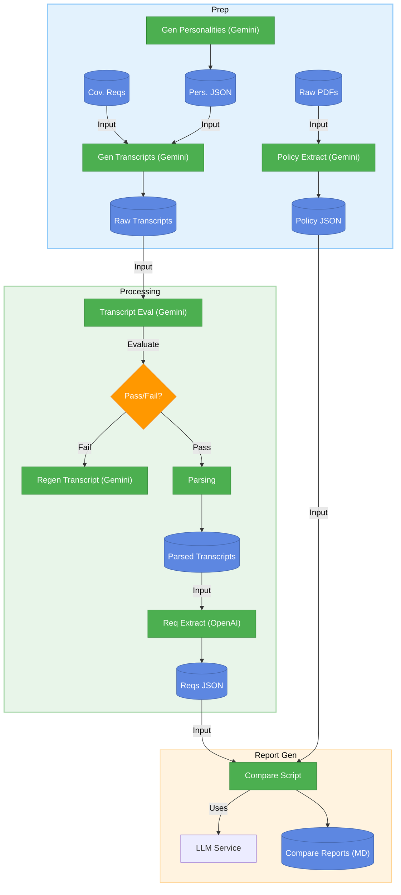

# Multi-Agent System for Insurance Policy Recommendations

A multi-agent system that transforms the complex process of buying travel insurance into a simple, personalized, and transparent experience.

## Project Overview

This system addresses common pain points in insurance purchasing by providing personalized, transparent, and objective recommendations through a conversational interface.

### Key Features

- **Conversational Interface**: Natural interaction with a Customer Service agent
- **Personalized Analysis**: Tailored recommendations based on individual needs
- **Multi-Agent Voting**: Consensus-based recommendations for increased reliability
- **Transparent Justifications**: Clear explanations linked to policy clauses
- **Iterative Refinement**: Ability to update requirements and receive new recommendations

## How To Use

This section outlines the primary workflows for preparing data, processing transcripts, and generating comparison reports within the system.



## 1. Data Preparation and Processing Pipeline

This section describes the end-to-end workflow for preparing policy data and generating/processing transcript data to extract customer requirements.

1.  **Extract Policy Data**:
    *   **Input**: Place raw insurance policy documents (PDF) into `data/policies/raw/` following the naming convention `insurer_{policy_tier}.pdf`.
    *   **Action**: Run `python scripts/extract_policy_tier.py`.
    *   **Process**: Uses Gemini API to extract structured coverage details for the specified tier, validates output using Pydantic.
    *   **Output**: Structured JSON files (`insurer_{policy_tier}.json`) saved in `data/policies/processed/`.

2.  **Generate Personalities (Optional)**:
    *   **Action**: If `data/transcripts/personalities.json` is missing or needs updating, run `python scripts/data_generation/generate_personalities.py`.
    *   **Process**: Uses Gemini API to generate a list of customer personalities.
    *   **Output**: `data/transcripts/personalities.json`.

3.  **Generate Synthetic Transcripts**:
    *   **Input**: `data/transcripts/personalities.json`, `data/coverage_requirements/coverage_requirements.py`. Optionally, specify a scenario file from `data/scenarios/` using `-s`.
    *   **Action**: Run `python scripts/data_generation/generate_transcripts.py -n <number_of_transcripts> [-s <scenario_name>]`.
    *   **Process**: Uses Gemini API to create synthetic conversation transcripts based on inputs.
    *   **Output**: Structured JSON transcript files saved in `data/transcripts/raw/synthetic/`. Filenames follow the format `transcript_{scenario_name}_{timestamp}.json` (if scenario used) or `transcript_{timestamp}.json` (if no scenario). Example: `transcript_golf_coverage_20250410_220036.json`.

4.  **Evaluate Raw Transcripts**:
    *   **Input**: Raw synthetic transcripts from `data/transcripts/raw/synthetic/`.
    *   **Action**: Run `python scripts/evaluation/transcript_evaluation/eval_transcript_main.py --directory data/transcripts/raw/synthetic/`.
    *   **Process**: Evaluates if the raw transcripts adequately cover standard and scenario-specific requirements using Gemini API.
    *   **Output**: Evaluation results saved in `data/evaluation/transcript_evaluations/`. (Note: The pipeline proceeds regardless of pass/fail currently).

5.  **Parse Raw Transcripts (Batch)**:
    *   **Input**: Raw synthetic transcripts (`.json`) from `data/transcripts/raw/synthetic/`.
    *   **Action**: Run `python src/utils/transcript_processing.py`.
    *   **Process**: Batch-processes all raw transcripts, parsing them into a standardized JSON list format.
    *   **Output**: Parsed JSON files saved in `data/transcripts/processed/` with a `parsed_` prefix (e.g., `parsed_transcript_golf_coverage_20250410_220036.json`).

6.  **Extract Requirements (Batch)**:
    *   **Input**: Parsed transcript JSON files from `data/transcripts/processed/`.
    *   **Action**: Run `python src/agents/extractor.py`. (Optionally specify `--input_dir` or `--output_dir`).
    *   **Process**: Batch-processes all parsed transcripts using the Extractor Agent (CrewAI with OpenAI) to extract structured requirements.
    *   **Output**: Structured requirements JSON files saved in `data/extracted_customer_requirements/`. Filenames follow the format `requirements_{original_name_part}.json` (e.g., `requirements_the_confused_novice_20250403_175921.json`), conforming to the `TravelInsuranceRequirement` Pydantic model.

This sequence takes you from raw data to structured policy information and customer requirements, ready for downstream analysis and comparison.

## 2. Policy Comparison Report Generation (Insurer-Level)

This step uses the structured requirements and policy data to generate detailed Markdown comparison reports **for each insurer** against a specific customer's needs. This script implements the insurer-level analysis approach, comparing all tiers of an insurer in a single LLM call.

1.  **Input**: Requires structured requirements JSON from step 6 (`data/extracted_customer_requirements/`) and processed policy JSON files from step 1 (`data/policies/processed/`). Also uses tier rankings from `data/policies/pricing_tiers/tier_rankings.py`.
2.  **Processing**: Run the `scripts/generate_policy_comparison.py` script, providing the **customer UUID** via the `--customer_id` argument.
    ```bash
    # Example using a specific customer UUID
    python scripts/generate_policy_comparison.py --customer_id 49eb20af-32b0-46e0-a14e-0dbe3e3c6e73
    ```
    The script finds the corresponding requirements file (`requirements_*_{uuid}.json`), identifies all available insurers and their tiers from `data/policies/processed/`, and uses the Gemini API via `LLMService` to generate a report for each insurer. It processes insurers asynchronously.
3.  **Output**: Markdown reports are saved to a subdirectory within `results/` named after the customer UUID (e.g., `results/49eb20af-32b0-46e0-a14e-0dbe3e3c6e73/`). Each report file is named `policy_comparison_report_{insurer}_{customer_uuid}.md` and contains:
    *   The recommended tier for that insurer.
    *   Justification for the recommendation.
    *   A detailed requirement-by-requirement analysis of the recommended tier's coverage.
    *   A summary of the recommended tier's strengths and weaknesses.

## 3. Policy Recommendation (Future)

The outputs from the previous steps (Structured Policy JSON, Structured Requirements JSON, and potentially the generated Comparison Reports) will serve as inputs to the future Analyzer Agent, which will compare them to generate personalized policy recommendations.

## Project Structure

```
/
├── data/                       # Data storage
│   ├── coverage_requirements/  # Standardized coverage requirements
│   ├── extracted_customer_requirements/ # Extracted requirements from transcripts
│   ├── policies/               # Insurance policy documents
│   │   ├── raw/                # Original PDF policy documents
│   │   └── processed/          # Processed policy JSON files
│   ├── scenarios/              # Scenario definitions for transcript generation
│   ├── transcripts/            # Conversation transcripts
│   │   ├── raw/                # Original conversation transcripts (synthetic/, real/)
│   │   └── processed/          # Processed JSON transcripts
│   └── evaluation/             # Evaluation data & results
│       └── transcript_evaluations/ # Transcript evaluation results
├── memory-bank/                # Cline's memory bank (documentation)
├── notebooks/                  # Jupyter notebooks for experimentation & prototyping
├── results/                    # Output comparison reports
├── scripts/                    # Utility & automation scripts (data generation, evaluation, etc.)
├── src/                        # Core application source code (agents, models, utils)
├── tests/                      # Test cases
├── tutorials/                  # Guides and example scripts
├── .gitignore                  # Git ignore file
├── README.md                   # This file
└── requirements.txt            # Project dependencies
```

## Key Workflow Components

The project structure supports the workflow illustrated in the diagram above:

1. **Data Inputs**
   - **Policy Documents**: Located in `data/policies/raw/` (PDF format)
   - **Call Transcripts**: Located in `data/transcripts/raw/` (text format)
   - **Coverage Requirements**: Defined in `data/coverage_requirements/coverage_requirements.py`

2. **Transcript Evaluation**
   - **Component**: `scripts/evaluation/transcript_evaluation/eval_transcript_main.py`
   - **Purpose**: Evaluates if transcripts contain all required coverage information (standard and scenario-specific).
   - **Input**: Raw transcript JSON files (e.g., from `data/transcripts/raw/synthetic/`). Can process a single file or a directory.
   - **Output**: Evaluation results saved in `data/evaluation/transcript_evaluations/` (by default) in specified formats (JSON, TXT, CSV summary).
   - **Usage Examples**:
     ```bash
     # Evaluate a single transcript
     python scripts/evaluation/transcript_evaluation/eval_transcript_main.py --transcript data/transcripts/raw/synthetic/transcript_golf_coverage_20250410_220036.json

     # Evaluate all transcripts in a directory
     python scripts/evaluation/transcript_evaluation/eval_transcript_main.py --directory data/transcripts/raw/synthetic/

     # Specify output directory and formats
     python scripts/evaluation/transcript_evaluation/eval_transcript_main.py --directory data/transcripts/raw/synthetic/ --output-dir custom/eval_results --format json,csv
     ```

3. **Transcript Processing**
   - **Component**: `src/utils/transcript_processing.py`
   - **Purpose**: Parses raw transcripts into structured JSON format
   - **Output**: JSON files in `data/transcripts/processed/`

4. **Requirement Extraction**
   - **Component**: `src/agents/extractor.py`
   - **Purpose**: Extracts structured customer requirements from parsed transcript JSON files using a CrewAI agent (configured with OpenAI). Run via CLI for batch processing.
   - **Input**: Directory containing processed transcript JSON files (default: `data/transcripts/processed/`).
   - **Output**: Saves structured requirements JSON to `data/extracted_customer_requirements/` (default). Filenames follow the format `requirements_{original_name_part}.json` (e.g., `requirements_the_confused_novice_20250403_175921.json`), conforming to the `TravelInsuranceRequirement` model.

5. **Policy Processing**
   - **Component**: `scripts/extract_policy_tier.py`
   - **Purpose**: Extracts structured coverage details from policy PDFs using Gemini API for a specific policy tier.
   - **Input**: PDFs from `data/policies/raw/` named `insurer_{policy_tier}.pdf`.
   - **Output**: Structured JSON policy data in `data/policies/processed/` named `insurer_{policy_tier}.json`.

6. **Data Generation Scripts**
   - **Component**: `scripts/data_generation/generate_personalities.py`
   - **Purpose**: Generates a list of common customer service personality types using the Gemini API (`gemini-2.5-pro-preview-03-25`).
   - **Output**: Saves a validated JSON file to `data/transcripts/personalities.json`. See the script's docstring for usage details.
   - **Component**: `scripts/data_generation/generate_transcripts.py`
   - **Purpose**: Generates synthetic conversation transcripts using the Gemini API (`gemini-2.5-pro-exp-03-25`), combining personalities from `personalities.json` and requirements from `coverage_requirements.py`. Can optionally use scenario files (`data/scenarios/`).
   - **Output**: Saves structured JSON transcripts to `data/transcripts/raw/synthetic/`. Filenames follow the format `transcript_{scenario_name_or_no_scenario}_{uuid}.json`. Accepts `-n` and `-s` arguments. See the script's docstring for details.

7. **Policy Comparison Report Generation (Insurer-Level)**
   - **Component**: `scripts/generate_policy_comparison.py`
   - **Purpose**: Generates detailed Markdown reports comparing extracted customer requirements against all tiers for each available insurer, recommending the best tier per insurer.
   - **Input**: Customer UUID (`--customer_id`), requirements JSON (`data/extracted_customer_requirements/requirements_*_{uuid}.json`), processed policy JSONs (`data/policies/processed/`), and tier rankings (`data/policies/pricing_tiers/tier_rankings.py`).
   - **Output**: Saves Markdown reports to `results/{uuid}/policy_comparison_report_{insurer}_{uuid}.md`. Each report includes the recommendation, justification, detailed requirement analysis, and summary. See the script's docstring for more details.

## Technical Stack

- **Python**: Primary programming language
- **Google Gemini & OpenAI**: LLMs for natural language processing (Gemini via `LLMService`, OpenAI via `crewai` for Extractor)
- **CrewAI**: Framework for multi-agent orchestration (used by Extractor)
- **Jupyter Notebooks**: Development environment
- **LLM Service**: Reusable interface to Google Gemini API

## Components

### LLM Service

The project includes a reusable LLM service that provides a unified interface to the Google Gemini API:

- **Configuration**: Environment-based configuration with support for different models and parameter sets
- **Features**: Content generation, structured output (JSON), streaming responses, batch processing
- **Error Handling**: Retry logic, validation, and comprehensive error management
- **Tutorial**: Example usage in `tutorials/llm_service_tutorial.py`

## Getting Started

1. Clone the repository
2. Install dependencies: `pip install -r requirements.txt`
3. Set up your Google Gemini API key:
   ```
   # In .env file or environment variables
   GOOGLE_API_KEY="your_google_api_key_here"
   OPENAI_API_KEY="your_openai_api_key_here"
   # OPENAI_MODEL_NAME="gpt-4o" # Optional: Defaults to gpt-4o if not set
   ```
4. Explore the notebooks in the `notebooks/` directory.
5. Check out the LLM service tutorial: `python tutorials/llm_service_tutorial.py`.
6. Run the Extractor agent (ensure transcript exists):
   ```bash
   # Example using a processed transcript
   python src/agents/extractor.py data/transcripts/processed/parsed_transcript_01.json
   ```

## Academic Project

This is an academic project focused on applying multi-agent AI systems to solve real-world problems in the insurance domain.
