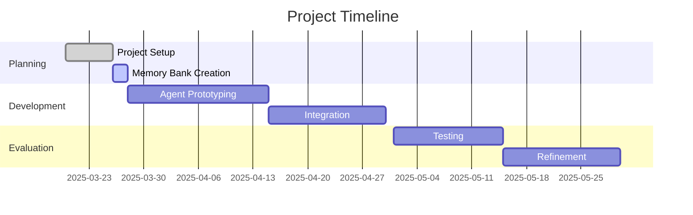

# Project Progress

## Current Status

The project is in the **initial setup and planning phase**. We are currently establishing the foundation for development by setting up the project structure, collecting data, and creating documentation.

### Project Timeline

## What Works

1.  **Project Structure**: Core directory structure is established.
2.  **Data Collection**: Initial policy PDFs and synthetic transcripts collected. Coverage requirements defined.
3.  **Documentation**: Core Memory Bank files initialized, README updated. (Undergoing update now).
4.  **LLM Service (Gemini)**: Reusable service (`src/models/llm_service.py`) for Gemini API interaction, including configuration, retries, and enhanced JSON parsing.
5.  **Data Generation Scripts**:
    *   `scripts/data_generation/generate_personalities.py`: Generates personality types.
    *   `scripts/data_generation/generate_transcripts.py`: Generates synthetic transcripts using scenarios, requirements, personalities, and `LLMService`.
6.  **Transcript Evaluation**: Script (`scripts/evaluation/transcript_evaluation/`) evaluates generated transcript quality using `LLMService`. Acts as a quality gate.
7.  **Transcript Parsing**: Utility (`src/utils/transcript_processing.py`) parses evaluated transcripts into a standard format.
8.  **Extractor Agent (CrewAI/OpenAI)**: Functional agent (`src/agents/extractor.py`) extracts structured requirements from processed transcripts using OpenAI via `crewai`. Includes batch processing.
9.  **Policy Extraction Script**: Script (`scripts/extract_policy_tier.py`) extracts structured policy details from PDFs using `LLMService`. Includes detailed extraction logic (base/conditional limits, source details).
10. **Policy Comparison Script**: Script (`scripts/generate_policy_comparison.py`) generates insurer-level Markdown comparison reports using `LLMService`, extracted requirements, and processed policies.
11. **PDF Extraction Evaluation Script**: Script (`scripts/evaluation/pdf_extraction_evaluation/eval_pdf_extraction.py`) compares processed policy JSON against source PDF using multi-modal LLM (`LLMService`) for accuracy/completeness checks. Enhanced with `--file_pattern` argument for flexible input filtering.
12. **Recommendation Report Script**: Script (`scripts/generate_recommendation_report.py`) orchestrates the two-stage recommendation process: parses comparison reports, applies Stage 1 scoring, calls `LLMService` for Stage 2 re-ranking (prompt updated to request source references), generates a final customer-friendly Markdown report, and saves it. Includes unit tests for parser, scoring, and Markdown generation.

## What's Left to Build

### Phase 1: Core Logic & Evaluation Enhancement

1.  **PDF Extraction Evaluation**:
    *   [ ] Test and refine the existing evaluation script (`eval_pdf_extraction.py`).
    *   [ ] Define clear metrics based on the script's output for accuracy and completeness.
2.  **Policy Comparison Evaluation**:
    *   [ ] Design and implement evaluation script/process for `scripts/generate_policy_comparison.py` output.
    *   [ ] Define metrics for report quality, accuracy of comparison, and justification clarity.
3.  **Refinement based on Evaluations**:
    *   [ ] Improve prompts, models, or logic in generation/extraction/comparison scripts based on evaluation results.

### Phase 2: Core Logic Integration & Refinement

1.  **Component Integration**:
    *   [ ] Define and implement how the different components (scripts, Extractor agent, Recommender script) should interact more broadly (beyond the internal Stage 1/2 integration in the recommender script).
    *   [ ] Consider orchestration methods for the full end-to-end pipeline (e.g., Extraction -> Comparison -> Recommendation).
2.  **Recommendation Personalization (Task 9)**:
    *   [ ] Enhance the final Markdown report (Task 6) with personalization by referencing key points or context from the original customer transcript.

### Phase 3: ML & Testing

1.  **ML Model Development**:
    *   [ ] Create supervised learning dataset (using extracted requirements, comparison results, etc.).
    *   [ ] Train initial models for insights.
    *   [ ] Evaluate feature importance.
2.  **User Interface (If Applicable)**:
    *   [ ] Design and develop a UI if direct user interaction (beyond running scripts) becomes a requirement.
3.  **Testing Framework**:
    *   [ ] Implement further unit tests for key functions/modules (some exist for recommender parser/scorer/markdown).
    *   [ ] Implement integration tests for script pipelines.

## Implementation Progress

| Component                          | Status      | Priority | Notes                                                                                                |
| :--------------------------------- | :---------- | :------- | :--------------------------------------------------------------------------------------------------- |
| Project Structure                  | 100%        | High     | Core structure established.                                                                          |
| Data Collection                    | 60%         | High     | More diverse policies and scenarios needed.                                                          |
| LLM Service (Gemini)               | 100%        | High     | `src/models/llm_service.py` - Centralized Gemini access.                                             |
| Data Generation Scripts            | 100%        | High     | `scripts/data_generation/` - Personalities & Transcripts.                                            |
| Transcript Evaluation Script       | 100%        | High     | `scripts/evaluation/transcript_evaluation/` - Quality gate for transcripts.                          |
| Transcript Parsing Utility         | 100%        | High     | `src/utils/transcript_processing.py` - Includes Pydantic model.                                      |
| Extractor Agent (CrewAI/OpenAI)    | 100%        | High     | `src/agents/extractor.py` - Extracts requirements. Uses OpenAI.                                      |
| Policy Extraction Script           | 100%        | High     | `scripts/extract_policy_tier.py` - Extracts structured policy data. Uses Gemini.                     |
| Policy Comparison Script           | 100%        | High     | `scripts/generate_policy_comparison.py` - Generates insurer-level reports. Uses Gemini.              |
| **PDF Extraction Evaluation**      | **100%**    | **High** | **Script implemented (`eval_pdf_extraction.py`) with `--file_pattern` enhancement. Testing/Refinement pending.** |
| Policy Comparison Evaluation       | Planned     | High     | Design and implement evaluation for `generate_policy_comparison.py`.                                 |
| **Recommender Logic Script**       | **100%**    | **High** | **`scripts/generate_recommendation_report.py` implemented (parser, score, re-rank, MD report).**     |
| **Component Integration**          | **20%**     | **Medium** | **Internal Stage 1/2 integration done. Full pipeline orchestration pending.**                        |
| Testing Framework                  | 20%         | Medium   | Unit tests added for recommender parser/scorer/MD report. More needed.                               |
| ML Models                          | 0%          | Low      | Later phase.                                                                                         |
| Documentation (Memory Bank)        | 98%         | High     | Core files updated for recommender script. Script/Agent docstrings mostly present.                   |

## Known Issues

1.  **LLM Accuracy & Consistency**:
    *   Ensuring high accuracy and consistent formatting from LLMs for extraction (policy, requirements) and comparison tasks remains a challenge. Requires ongoing prompt tuning and potentially model updates.
    *   Adherence to complex JSON schemas (e.g., policy extraction) needs careful validation.
2.  **Evaluation Gaps**:
    *   Lack of automated evaluation for *comparison report* quality. Manual review is currently required for that step. (Policy extraction evaluation script now exists but needs testing).
3.  **Synthetic Data Limitations**:
    *   Generated transcripts might not fully capture the nuances of real user interactions.
4.  **LLM Constraints**:
    *   API rate limits, costs, and potential output token limits need management. `LLMService` helps mitigate some aspects (retries, central config).
5.  **Lack of Integration**:
    *   Current components are largely standalone scripts. No automated workflow connects them end-to-end. Manual execution is required for each step.
6.  **Extractor Agent Dependency**:
    *   The Extractor Agent relies on OpenAI/CrewAI, separate from the Gemini-based `LLMService` used elsewhere. This adds complexity to configuration and potential cost management.

## Recent Achievements (Summary - See `activeContext.md` for full detail)

1.  **Core Infrastructure**: Project setup, Memory Bank init, LLM Service (Gemini).
2.  **Data Pipelines**: Scripts for generating personalities, transcripts (with scenarios), evaluating transcripts, parsing transcripts, extracting policy details (PDF to structured JSON), and generating comparison reports.
3.  **Extractor Agent**: Implemented using CrewAI/OpenAI for requirement extraction.
4.  **Recommender Script**: Implemented `scripts/generate_recommendation_report.py` with Stage 1 scoring, Stage 2 LLM re-ranking (with source ref prompt update), and Markdown report generation. Added unit tests.
5.  **Refinements**: Centralized Gemini config, improved policy extraction detail, standardized filenames, refactored comparison script for insurer-level analysis, enhanced evaluation robustness, added file pattern filtering to PDF eval script.

## Next Milestones (Revised Focus)

1.  **Evaluation Implementation & Refinement** (Target: End April 2025)
    *   Test and refine the existing PDF extraction evaluation script (`eval_pdf_extraction.py`).
    *   Implement automated evaluation for comparison reports (`scripts/generate_policy_comparison.py`).
2.  **Core Logic Refinement** (Target: Mid May 2025)
    *   Refine generation/extraction/comparison based on evaluation results.
    *   Refine generation/extraction/comparison/recommendation based on evaluation results.
3.  **Integration & Workflow V1** (Target: End May 2025)
    *   Develop basic orchestration to connect key script steps (e.g., Extraction -> Comparison -> Recommendation).
    *   Establish initial testing framework (unit/integration).
4.  **ML Exploration** (Target: June 2025)
    *   Prepare dataset and train initial ML models for insights.
