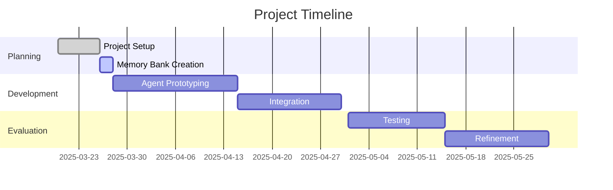

# Project Progress

## Current Status

The project is in the **initial setup and planning phase**. We are currently establishing the foundation for development by setting up the project structure, collecting data, and creating documentation.

### Project Timeline

## What Works

1. **Project Structure**:
   - Basic directory structure is in place
   - Key directories for code, data, and documentation are established

2. **Data Collection**:
   - Initial set of insurance policy PDFs collected
   - Synthetic conversation transcripts created for testing
   - Some policies processed into text format (Note: Manual text processing is now superseded by `scripts/extract_policy_tier.py`)
   - Standardized coverage requirements defined (initially 5 types, later updated).
   - Added `customer_context_options` to `coverage_requirements.py` to guide richer transcript generation.

3. **Documentation**:
   - Project brief created with clear goals and scope
   - README with project overview
   - Memory bank initialized with core documentation

4. **LLM Service**:
   - Reusable Google Gemini service implemented
   - Configuration system with environment variable support
   - Multiple content generation methods (basic with optional `max_output_tokens`, structured, streaming, batch)
   - Error handling and retry logic
   - Comprehensive tutorial with examples
   - Fixed issues related to safety settings and deprecated types

5. **Transcript Evaluation**:
   - Script to evaluate customer service agent performance
   - Direct integration with Google Gemini API
   - Fallback to prompt generation when API is unavailable
   - Support for batch processing of multiple JSON transcripts (parser updated for JSON-only input)
   - Structured output in multiple formats (JSON, TXT, CSV)
   - Evidence-based evaluations with transcript quotes

6. **Extractor Agent**:
   - Functional Extractor Agent implemented using `crewai` (`src/agents/extractor.py`).
   - Uses OpenAI (via `.env` config) for extraction.
   - Accepts transcript path via CLI argument.
   - Uses `TravelInsuranceRequirement` Pydantic model for structured output.
   - Saves extracted requirements to `data/extracted_customer_requirements/` with dynamic filename linked to input transcript.
   - Correctly handles JSON serialization of Pydantic output.

7. **Policy Extraction Script**:
   - Created `scripts/extract_policy_tier.py` to automate extraction of structured policy data from PDFs using Gemini.
   - Replaces previous manual/notebook PDF processing.
   - Includes validation, retries, and documentation.

8. **Personality Data Generation**:
   - Script `scripts/data_generation/generate_personalities.py` created.
   - Uses Gemini (`gemini-2.5-pro-exp-03-25`) and Pydantic validation.
   - Generates `data/transcripts/personalities.json`.
   - Includes usage documentation in the script's docstring.

9. **Policy Comparison Report Script**:
   - Created `scripts/generate_policy_comparison.py`.
   - Uses Gemini (`gemini-2.5-pro-exp-03-25`) via `LLMService`.
   - Takes customer requirements JSON as input.
   - Compares requirements against all processed policy JSONs (`data/policies/processed/`).
   - Generates Markdown reports asynchronously in batches.
   - Saves reports to `results/{customer_id}_{timestamp}/`.
   - Includes customer summary and description in the report.

## What's Left to Build

### Phase 1: Agent Development

1. **CS Agent**:
   - [ ] Conversation handling
   - [ ] User requirement elicitation
   - [ ] Prompt templates
   - [ ] Integration with LLM service

2. **Extractor Agent**:
   - [x] Transcript parsing (via LLM)
   - [x] Customer profile generation (structured JSON output via Pydantic)
   - [x] Requirement prioritization (implicit in prompt/model)
   - [x] Integration with OpenAI LLM (via `crewai` and `.env`)
   - [x] CLI Runner (`src/agents/extractor.py` directly)

3. **Analyzer Agent**:
   - [x] Policy parsing (Now handled by `scripts/extract_policy_tier.py` using Gemini)
   - [ ] Requirement matching (Consumes JSON output from Extractor and Policy Extraction Script)
   - [ ] Analysis report generation
   - [ ] Integration with LLM service

4. **Voting System**:
   - [x] Multiple LLM call mechanism (via LLM service batch generation)
   - [ ] Result aggregation
   - [ ] Confidence scoring

5. **Recommender Agent**:
   - [ ] Recommendation formulation
   - [ ] Justification generation
   - [ ] Email formatting

### Phase 2: Integration

1. **Agent Communication**:
   - [ ] Data passing between agents
   - [ ] Error handling
   - [ ] Logging

2. **End-to-End Workflow**:
   - [ ] Pipeline orchestration
   - [ ] State management
   - [ ] User feedback loop

### Phase 3: Evaluation and Refinement

1. **Testing Framework**:
   - [ ] Unit tests
   - [ ] Integration tests
   - [ ] Performance benchmarks

2. **ML Model Development**:
   - [ ] Dataset creation
   - [ ] Model training
   - [ ] Feature importance analysis

3. **User Experience**:
   - [ ] Conversation flow optimization
   - [ ] Recommendation format refinement
   - [ ] Feedback incorporation

## Implementation Progress

| Component | Status | Priority | Notes |
|-----------|--------|----------|-------|
| Project Structure | 100% | High | Core structure established. Data folders reorganized. |
| Data Collection | 60% | High | More policies and transcripts needed |
| LLM Service | 100% | High | Complete implementation with tutorial and fixes. Enhanced JSON parsing. |
| Transcript Evaluation | 100% | High | Refactored into flat structure (`scripts/evaluation/transcript_evaluation/`). Enhanced to handle scenarios. |
| Policy Extraction Script | 100% | High | Automates structured data extraction from policy PDFs. Refined to handle base/conditional limits and source-specific details. |
| CS Agent | 0% | High | Not started |
| Extractor Agent | 100% | High | Implemented with `crewai` (OpenAI), CLI input, dynamic output path, JSON fix |
| Analyzer Agent | 5% | High | Policy parsing step now automated, analysis logic pending |
| Voting System | 20% | Medium | LLM batch mechanism implemented, aggregation pending |
| Recommender Agent | 0% | High | Not started |
| Integration | 0% | Medium | Depends on agent development |
| Testing | 0% | Medium | Not started |
| ML Models | 0% | Low | Later phase |
| Documentation | 75% | High | Initial docs created, LLM service documented, Memory Bank updated, New scripts documented |
| Personality Data Generation Script | 100% | Medium | Generates personality types for potential use in CS agent or analysis |
| Policy Comparison Script | 100% | Medium | Generates comparison reports between requirements and policies |

## Known Issues

1. **Policy Extraction Accuracy**:
   - Ensuring the LLM in `scripts/extract_policy_tier.py` accurately interprets complex policy documents and adheres strictly to the JSON schema.

2. **Synthetic Data Limitations**:
   - Current synthetic transcripts may not cover all real-world scenarios
   - Need more diverse conversation examples
   - May need to supplement with real conversation data

3. **LLM Constraints**:
   - API rate limits may affect development and testing
   - Response quality varies with prompt design
   - Need to optimize for both quality and cost
   - Default settings (like `max_output_tokens`) can cause unexpected truncation.

4. **Integration Complexity**:
   - Multiple agents increase system complexity
   - Error propagation between components
   - Need robust error handling and recovery

## Recent Achievements

1. **Project Initialization**:
   - Repository created
   - Basic structure established
   - Initial documentation created

2. **Memory Bank Setup**:
   - Core documentation files created
   - Project context documented
   - Technical architecture defined

3. **Coverage Requirements Implementation**:
   - Created standardized dictionary of travel insurance coverage requirements
   - Implemented five key coverage types with detailed attributes
   - Added utility functions for accessing the requirements
   - Established foundation for transcript generation and evaluation

4. **LLM Service Implementation**:
   - Created a reusable Google Gemini service (src/models/llm_service.py)
   - Implemented configuration system with environment variables (src/models/gemini_config.py)
   - Added support for various content generation methods
   - Implemented error handling, retry logic, and validation
   - Created comprehensive tutorial with examples (tutorials/llm_service_tutorial.py)
   - Updated project dependencies in requirements.txt

5. **Transcript Evaluation System**:
   - Refactored the evaluation script into a modular system with clear separation of concerns
   - Organized into specialized modules with the `eval_transcript` prefix
   - Created a new main entry point `eval_transcript_main.py`
   - Improved maintainability, testability, and reusability of the code
   - Added comprehensive documentation with a dedicated README
   - Preserved all original functionality including Gemini integration and multiple output formats

6. **Transcript Evaluation Enhancement**:
   - Implemented schema-based JSON responses using Pydantic models
   - Fixed compatibility issues with the Google Gemini API
   - Updated to use the available "gemini-2.0-flash" model
   - Added robust error handling and fallback mechanisms
   - Enhanced documentation with detailed explanation of the schema-based approach
   - Improved reliability by reducing JSON parsing errors
   - Successfully tested with synthetic transcript data

7. **Extractor Agent Implementation**:
   - Completed implementation of the Extractor Agent using `crewai`.
   - Enriched Pydantic model for structured output.
   - Created CLI runner script for execution.
   - Successfully extracted requirements from test transcripts.

8. **Workflow Documentation Update**:
   - Updated `README.md` and `memory-bank/systemPatterns.md` to accurately reflect the current workflow, replacing references to the notebook prototype with the `src/agents/extractor.py` implementation.

9. **Data Directory Reorganization**:
   - Reorganized `data/` folder to group policies (`data/policies/raw`, `data/policies/processed`) and transcripts (`data/transcripts/raw`, `data/transcripts/processed`).
   - Updated Memory Bank documentation to reflect new structure.

10. **Policy Extraction Automation**:
    - Implemented `scripts/extract_policy_tier.py` to replace manual PDF processing.
    - Configured script to use `gemini-2.5-pro-exp-03-25`.
    - Added usage documentation to the script.

11. **Extractor Agent Script Enhancement**:
    - Refactored `src/agents/extractor.py` to align with notebook logic, use OpenAI, accept CLI input, save output dynamically to the correct folder, and fix JSON serialization.

12. **Personality Data Generation**:
    - Created `scripts/data_generation/generate_personalities.py` script.
   - Generated `data/transcripts/personalities.json` data file.
   - Added documentation to the script.

13. **Transcript Generation Script**:
    - Created `scripts/data_generation/generate_transcripts.py` to automate the generation of synthetic transcripts using Gemini (`gemini-2.5-pro-exp-03-25`).
    - The script uses `data/transcripts/personalities.json` and `data/coverage_requirements/coverage_requirements.py` as inputs.
    - It includes command-line arguments (`-n`) to specify the number of transcripts to generate.
    - The output is saved as structured JSON (list of speaker turns) in `data/transcripts/raw/synthetic/` with timestamped filenames (`transcript_{personality}_{YYYYMMDD_HHMMSS}.json`).
    - Includes parsing logic and fallback for raw text saving if parsing fails.

14. **Transcript Processing Enhancements (`src/utils/transcript_processing.py`)**:
    - Modified `parse_transcript` function to handle both `.txt` (original format) and the new nested `.json` format (from `generate_transcripts.py`). It now extracts the relevant `transcript` list from JSON files.
    - Updated the `main` function to perform batch processing: it iterates through all `.txt` and `.json` files in `data/transcripts/raw/synthetic/` and saves the parsed output (JSON list) to `data/transcripts/processed/` with a `parsed_` prefix.

15. **Extractor Agent Batch Processing & Filename Update (`src/agents/extractor.py`)**:
    - Modified the `main` function to perform batch processing: it iterates through all `.json` files in the input directory (defaulting to `data/transcripts/processed/`) and runs the extractor agent on each.
    - Changed the output filename format saved to `data/extracted_customer_requirements/` to `requirements_{original_name_part}.json` (e.g., `requirements_the_anxious_inquirer_20250403_152253.json`).
    - Added a comprehensive docstring explaining the script's purpose, usage, I/O, dependencies, and arguments.

16. **Transcript Evaluation Parser Update**:
    - Modified `scripts/evaluation/processors/eval_transcript_parser.py` to handle JSON transcripts exclusively, removing `.txt` support.
    - Updated `scripts/evaluation/eval_transcript_main.py` docstring and help text to reflect JSON-only input.

17. **Coverage Requirements & Transcript Generation Update**:
    - Updated coverage types in `data/coverage_requirements/coverage_requirements.py` to: `medical_coverage`, `trip_cancellation`, `travel_delays`, `lost_damaged_luggage`, `sports_adventure`, `war_cover`.
    - Updated `scripts/data_generation/generate_transcripts.py` to import and use `customer_context_options` in its prompt generation.

18. **Transcript Generation Prompt Refinement**:
    - Iteratively refined the `PROMPT_TEMPLATE` in `scripts/data_generation/generate_transcripts.py` to improve coverage and realism.
    - Clarified agent vs. customer initiation roles for context and coverage requirements.
    - Merged and streamlined guideline/requirement sections for better clarity.

19. **Transcript Generation Debugging & Enhancement**:
    - Added logging to `scripts/data_generation/generate_transcripts.py` for prompt and raw LLM response.
    - Updated `src/models/llm_service.py` to support `max_output_tokens`.
    - Updated `scripts/data_generation/generate_transcripts.py` to set `max_output_tokens=10000` to mitigate potential truncation.

20. **Gemini Configuration Centralization & Refactoring**:
    - Updated `src/models/gemini_config.py` to set the default model to `gemini-2.5-pro-exp-03-25` and default `max_output_tokens` to `10000`.
    - Enhanced `src/models/llm_service.py` to support multi-modal `contents` input in `generate_content`.
    - Refactored several scripts (`scripts/extract_policy_tier.py`, `scripts/evaluation/evaluators/eval_transcript_gemini.py`, `scripts/data_generation/generate_personalities.py`) to use the centralized `LLMService` instead of direct `google.generativeai` calls, leveraging the central configuration and retry logic.
    - Removed redundant `max_output_tokens` override from `scripts/data_generation/generate_transcripts.py` as it now matches the default.
    - Updated Memory Bank documentation (`techContext.md`, `activeContext.md`) to reflect these changes.

21. **Policy Comparison Report Script**:
    - Created `scripts/generate_policy_comparison.py`.
    - Fixed initial `KeyError` related to prompt formatting.
    - Added customer summary and description to the report output.

22. **Policy Extraction Refinement (`scripts/extract_policy_tier.py`)**:
    - Updated Pydantic models and prompt template to support a more granular extraction structure (base limits, conditional limits, source-specific details).
    - Improved clarity of instructions and examples for the LLM regarding benefit consolidation and the new structure.

23. **Transcript Generation Scenario Support**:
    - Enhanced `scripts/data_generation/generate_transcripts.py` to support scenario-based transcript generation.
    - Created a new directory structure (`data/scenarios/`) to store scenario definitions.
    - Implemented a JSON-based scenario format with fields for scenario name, description, additional requirements, and prompt instructions.
    - Created four scenario files for testing specific coverage types that are unique to different insurance providers.
    - Added a new command-line argument (`--scenario` or `-s`) to specify which scenario to use.
    - Modified the prompt template to include scenario-specific requirements and instructions.
    - Updated the output JSON to include scenario information.
    - Changed the output filename format to `transcript_{scenario_name_or_no_scenario}_{customer_id}.json` (using "no_scenario" if no scenario is specified, and replacing the timestamp with a UUID).
    - Updated script documentation to explain the new feature.

24. **Transcript Evaluation Scenario Handling & Refactoring**:
    - Updated `generate_transcripts.py` to always include `"scenario": null`.
    - Refactored evaluation scripts into `scripts/evaluation/transcript_evaluation/`.
    - Enhanced evaluation system to handle scenario-specific requirements.
    - Improved JSON parsing robustness in `LLMService`.
    - Updated `README.md` with new structure and usage.

25. **Filename Standardization**:
    - Modified `src/utils/transcript_processing.py` to output processed transcripts as `parsed_transcript_{scenario_name}_{uuid}.json`.
    - Confirmed `src/agents/extractor.py` correctly uses the new input format to output requirements as `requirements_{scenario_name}_{uuid}.json`.
    - Updated Memory Bank (`systemPatterns.md`, `techContext.md`, `activeContext.md`) to reflect the new standard.

## Next Milestones

1. **Agent Prototyping** (Target: April 15, 2025)
   - Functional prototypes of CS, Analyzer, Voting, Recommender agents
   - Basic end-to-end workflow (Extractor -> Analyzer)

2. **Integration Completion** (Target: April 30, 2025)
   - Fully integrated system
   - Robust error handling
   - Complete workflow

3. **Evaluation and Refinement** (Target: May 30, 2025)
   - Comprehensive testing
   - Performance optimization
   - User experience improvements
