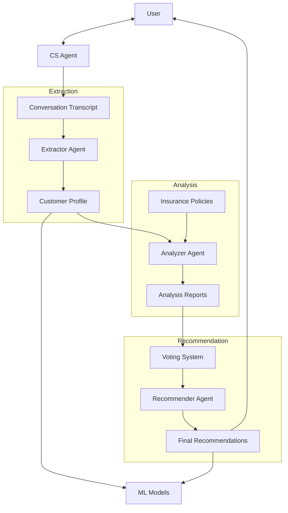
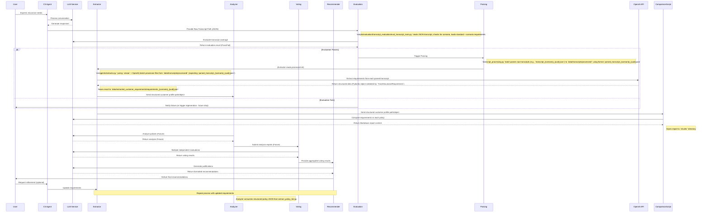

# System Patterns

## System Architecture

The project follows a multi-agent architecture with specialized components working together to deliver personalized insurance recommendations:

## Key Technical Decisions

1. **Multi-Agent System**:
   - Decision: Use specialized agents for different tasks rather than a monolithic approach
   - Rationale: Improves modularity, allows for independent optimization, and enables consensus-based recommendations
   - Implementation: Five distinct agents (CS Agent, Extractor, Analyzer, Voting, Recommender). Extractor implemented using `crewai`.

2. **LLM-Based Reasoning**:
   - Decision: Use LLMs for natural language understanding and reasoning
   - Rationale: Enables complex pattern recognition in unstructured text and natural conversation
   - Implementation: Primarily Google Gemini accessed via `LLMService`. However, the Extractor agent currently uses OpenAI (configured via `.env` variables) through the `crewai` framework. Other agents may also use specific LLMs if needed (e.g., policy extraction script).

3. **Voting Mechanism**:
   - Decision: Implement a consensus-based voting system with multiple independent LLM calls
   - Rationale: Reduces bias and improves reliability of recommendations
   - Implementation: Multiple asynchronous LLM instances evaluating the same data

4. **Hybrid Approach**:
   - Decision: Combine LLM-based reasoning with traditional ML
   - Rationale: Leverages strengths of both approaches (LLM for reasoning, ML for pattern recognition)
   - Implementation: LLMs for agent reasoning, supervised ML for insights

5. **Structured Knowledge Representation**:
   - Decision: Transform unstructured policy documents and conversations into structured data
   - Rationale: Enables systematic comparison and analysis
   - Implementation: Pydantic models (`TravelInsuranceRequirement`) for validated JSON-structured customer profiles (Extractor output), analysis reports, and standardized coverage requirements.

## Design Patterns

1. **Agent Pattern**:
   - Each agent is a specialized entity with specific responsibilities
   - Agents communicate through structured data formats
   - Implementation: Python classes with defined interfaces, potentially managed by frameworks like `crewai`.

2. **Pipeline Pattern**:
   - Sequential processing of data through specialized stages (e.g., Transcript -> Extractor -> Analyzer)
   - Each stage transforms or enriches the data
   - Implementation: Workflow from conversation to extraction to analysis to recommendation

3. **Observer Pattern**:
   - The CS Agent observes and responds to user inputs
   - The Recommender observes voting results
   - Implementation: Event-driven communication

4. **Strategy Pattern**:
   - Different strategies for policy analysis based on customer needs
   - Flexible approach to recommendation generation
   - Implementation: Configurable analysis parameters

5. **Factory Pattern**:
   - Creation of appropriate analysis and recommendation objects
   - Standardized interfaces for different types of analyses
   - Implementation: Factory methods for creating analysis instances

6. **Composite Pattern**:
   - Complex customer requirements composed of simpler components
   - Hierarchical organization of policy features
   - Implementation: Nested JSON structures

## Component Relationships

### LLM Service
- **Inputs**: Prompts, parameters (including optional `max_output_tokens`), model selection
- **Outputs**: Generated content, structured data
- **Dependencies**: Google Gemini API
- **Consumers**: All agents (CS, Extractor, Analyzer, Voting, Recommender)

### CS Agent
- **Inputs**: User queries and responses
- **Outputs**: Conversation transcripts
- **Dependencies**: LLM Service
- **Consumers**: Extractor Agent

### Extractor Agent (and preceding steps)
- **Inputs**:
    - Raw Conversation Transcripts (`data/transcripts/raw/*`)
    - Raw Conversation Transcripts (`data/transcripts/raw/*.json`) - Now expects JSON format.
    - Coverage Requirements (`data/coverage_requirements/coverage_requirements.py`)
    - Scenario Definitions (`data/scenarios/*.json`) - Optional scenario-specific requirements.
- **Processing Steps**:
    1. **Generation**: `scripts/data_generation/generate_transcripts.py` generates raw transcripts using Gemini, incorporating standard requirements, optional scenario requirements, and personality profiles. Output filename: `transcript_{scenario_name_or_no_scenario}_{customer_id}.json`. Output JSON includes `customer_id`, `personality`, `transcript` (dialogue list), and `scenario` (name or null).
    2. **Evaluation**: `scripts/evaluation/transcript_evaluation/eval_transcript_main.py` evaluates raw **JSON** transcript against standard coverage requirements (`data/coverage_requirements/`) and any applicable scenario-specific requirements (loaded from `data/scenarios/` based on the transcript's "scenario" field). Uses modules within the same directory (`eval_transcript_parser.py`, `eval_transcript_prompts.py`, `eval_transcript_gemini.py`).
    3. **Parsing (if evaluation passes)**: `src/utils/transcript_processing.py` parses raw transcripts (e.g., `transcript_{scenario}_{uuid}.json`) from `data/transcripts/raw/synthetic/` and saves structured JSON lists to `data/transcripts/processed/` using the format `parsed_transcript_{scenario_name}_{uuid}.json` (batch processing when run directly). Note: While this script *can* handle `.txt`, the preceding evaluation step now only processes `.json`.
    4. **Extraction**: The `src/agents/extractor.py` script (using `crewai` with OpenAI configured via `.env`) consumes all `.json` files from an input directory (default: `data/transcripts/processed/`, expecting `parsed_transcript_{scenario_name}_{uuid}.json` format) and runs the Extractor Agent on each (batch processing when run directly). Accepts optional `--input_dir` and `--output_dir` arguments.
- **Outputs**: Structured customer profiles saved as JSON files in `data/extracted_customer_requirements/`. The filename format is now `requirements_{scenario_name}_{uuid}.json` (e.g., `requirements_golf_coverage_49eb20af-32b0-46e0-a14e-0dbe3e3c6e73.json`). The JSON structure matches the `TravelInsuranceRequirement` Pydantic model.
- **Dependencies**: `scripts/data_generation/generate_transcripts.py`, `scripts/evaluation/transcript_evaluation/`, `src/utils/transcript_processing.py` (for model definition and parsing step), `src/agents/extractor.py`, `crewai` framework, OpenAI API (via `.env`), `TravelInsuranceRequirement` model.
- **Consumers**: Analyzer Agent, ML Models.

### Policy Processing
- **Script**: `scripts/extract_policy_tier.py`
- **Inputs**: Raw Policy PDFs (`data/policies/raw/insurer_{policy_tier}.pdf`)
- **Processing**: Uses Gemini API via `LLMService` to extract tier-specific coverage details based on a detailed prompt emphasizing benefit consolidation. It identifies base limits, optional conditional limits (e.g., for add-ons), and extracts specific detail snippets linked to their source locations within the PDF. Validates the complex nested output structure using Pydantic models (`PolicyExtraction`, `CoverageCategory`, `CoverageDetail`, `LimitDetail`, `ConditionalLimit`, `SourceDetail`).
- **Outputs**: Structured Policy JSON files (`data/policies/processed/insurer_{policy_tier}.json`). The JSON structure includes:
    - `provider_name`, `policy_name`, `tier_name`, `extraction_date`, `currency`
    - `coverage_categories`: List of categories.
        - Each category contains `coverages`: List of consolidated benefits.
            - Each coverage includes:
                - `coverage_name`
                - `base_limits`: List of standard limits (`LimitDetail`).
                - `conditional_limits`: Optional list of limits under specific conditions (`ConditionalLimit`).
                - `source_specific_details`: List of detail snippets linked to their source (`SourceDetail`).
- **Dependencies**: `LLMService`, Pydantic models defined within the script.
- **Consumers**: Analyzer Agent, Policy Comparison Script

### Policy Comparison Script
- **Script**: `scripts/generate_policy_comparison.py`
- **Inputs**: Structured Requirements JSON (`data/extracted_customer_requirements/`), Processed Policy JSONs (`data/policies/processed/`)
- **Processing**: Uses Gemini API via `LLMService` to compare requirements against each policy based on a detailed prompt. Processes asynchronously in batches.
- **Outputs**: Markdown comparison reports (`results/{customer_id}_{timestamp}/policy_comparison_{provider}_{tier}_{customer_id}_{timestamp}.md`)
- **Dependencies**: LLM Service, Extractor Agent output, Policy Processing Script output.
- **Consumers**: End users (for viewing reports), potentially Analyzer Agent (for input/inspiration).

### Analyzer Agent
- **Inputs**: Customer profiles (JSON), Structured Policy Data (JSON from `extract_policy_tier.py`)
- **Outputs**: Analysis reports
- **Dependencies**: Extractor Agent, Policy Processing Script Output, LLM Service
- **Consumers**: Voting System

### Voting System
- **Inputs**: Analysis reports
- **Outputs**: Aggregated voting results
- **Dependencies**: Analyzer Agent, LLM Service (batch generation)
- **Consumers**: Recommender Agent

### Recommender Agent
- **Inputs**: Voting results
- **Outputs**: Final recommendations with justifications
- **Dependencies**: Voting System, LLM Service
- **Consumers**: User, ML Models

### ML Models
- **Inputs**: Customer profiles, Final recommendations
- **Outputs**: Insights on feature importance, product positioning
- **Dependencies**: Extractor Agent, Recommender Agent
- **Consumers**: System administrators, Insurance companies

## Data Flow

## Error Handling and Resilience

1. **Input Validation**:
   - Each agent validates inputs before processing
   - Structured schemas enforce data consistency

2. **Fallback Mechanisms**:
   - Default recommendations when specific requirements can't be met
   - Graceful degradation when optimal solutions aren't available

3. **Uncertainty Management**:
   - Explicit confidence scores for recommendations
   - Multiple voting rounds for ambiguous cases

4. **Feedback Loops**:
   - User feedback incorporated into recommendation refinement
   - System performance metrics tracked for continuous improvement
