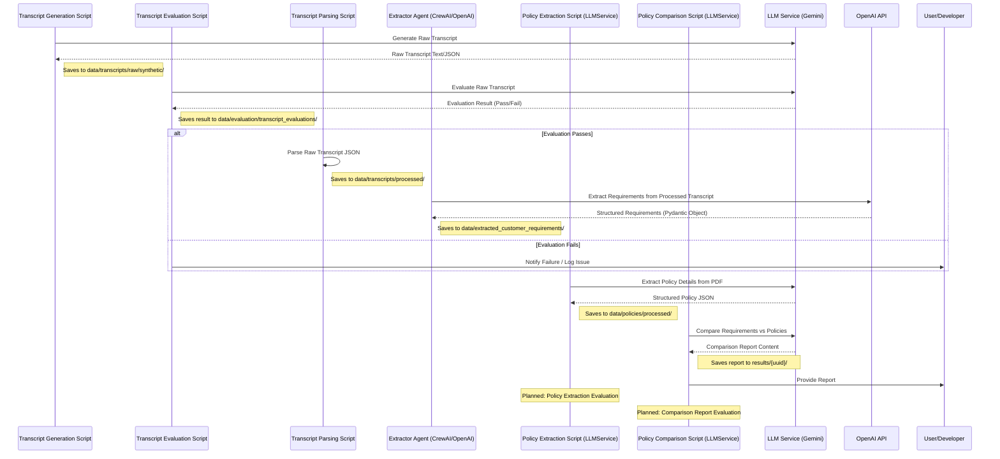

# System Patterns

## System Architecture

The project currently follows a script-driven workflow focused on data generation, processing, extraction, and evaluation, with a single implemented agent (Extractor). The original multi-agent concept (CS, Analyzer, Voting, Recommender) is not yet implemented.

```mermaid
flowchart TD
    subgraph Data Generation
        direction LR
        GenPersonalities[scripts/data_generation/generate_personalities.py] --> PersonalitiesJson[data/transcripts/personalities.json]
        CoverageReqs[data/coverage_requirements/coverage_requirements.py] --> GenTranscripts
        Scenarios[data/scenarios/*.json] --> GenTranscripts
        PersonalitiesJson --> GenTranscripts
        GenTranscripts[scripts/data_generation/generate_transcripts.py] --> RawTranscripts[data/transcripts/raw/synthetic/*.json]
    end

    subgraph Transcript Processing & Extraction
        direction LR
        RawTranscripts --> EvalTranscripts[scripts/evaluation/transcript_evaluation/eval_transcript_main.py]
        EvalTranscripts -- Pass --> ParseTranscripts[src/utils/transcript_processing.py]
        ParseTranscripts --> ProcessedTranscripts[data/transcripts/processed/*.json]
        ProcessedTranscripts --> ExtractorAgent[src/agents/extractor.py (CrewAI/OpenAI)]
        ExtractorAgent --> ExtractedReqs[data/extracted_customer_requirements/*.json]
    end

    subgraph Policy Processing
        direction LR
        RawPolicies[data/policies/raw/*.pdf] --> ExtractPolicyScript[scripts/extract_policy_tier.py (LLMService/Gemini)]
        ExtractPolicyScript --> ProcessedPolicies[data/policies/processed/*.json]
    end

    subgraph Reporting & Analysis (Standalone)
        direction LR
        ExtractedReqs --> ComparisonScript[scripts/generate_policy_comparison.py (LLMService/Gemini)]
        ProcessedPolicies --> ComparisonScript
        ComparisonScript --> ComparisonReports[results/{uuid}/*.md]
    end

    subgraph Evaluation Focus
        direction TB
        EvalTranscripts --> EvalTranscriptResults[data/evaluation/transcript_evaluations/*.json]
        ExtractPolicyScript --> PlannedPolicyEval{Planned: Policy Extraction Evaluation}
        ComparisonScript --> PlannedComparisonEval{Planned: Comparison Report Evaluation}
    end

    Data Generation --> Transcript Processing & Extraction
    Policy Processing --> Reporting & Analysis (Standalone)
    Transcript Processing & Extraction --> Reporting & Analysis (Standalone)

    Transcript Processing & Extraction --> Evaluation Focus
    Policy Processing --> Evaluation Focus
    Reporting & Analysis (Standalone) --> Evaluation Focus

    ComparisonReports --> User[User/Developer]
    ExtractedReqs --> FutureML{Future: ML Models}
```

## Key Technical Decisions

1.  **Script-Driven Workflow**:
    *   Decision: Implement core logic (data generation, policy extraction, comparison) as standalone Python scripts.
    *   Rationale: Allows for modular development and testing of individual components before full agent integration. Enables batch processing.
    *   Implementation: Various scripts in `scripts/` directory (e.g., `generate_transcripts.py`, `extract_policy_tier.py`, `generate_policy_comparison.py`).

2.  **Single Agent Implementation (Extractor)**:
    *   Decision: Implement the Extractor using the `crewai` framework with OpenAI.
    *   Rationale: Leverages existing agent framework for a specific, well-defined task (requirement extraction). Allows experimentation with agent-based approaches.
    *   Implementation: `src/agents/extractor.py`.

3.  **Centralized LLM Service (Gemini)**:
    *   Decision: Create a reusable service (`LLMService`) for interacting with Google Gemini.
    *   Rationale: Standardizes API calls, configuration, error handling, and retry logic for most LLM tasks.
    *   Implementation: `src/models/llm_service.py` used by most scripts. Note: Extractor agent uses OpenAI directly via `crewai`.

4.  **Emphasis on Evaluation**:
    *   Decision: Integrate evaluation steps at key points in the workflow.
    *   Rationale: Ensures data quality and component performance before proceeding to downstream tasks. Provides metrics for improvement.
    *   Implementation: `scripts/evaluation/transcript_evaluation/` for transcript quality. Planned evaluations for policy extraction and comparison report accuracy.

5.  **Structured Knowledge Representation**:
    *   Decision: Transform unstructured policy documents and conversations into structured data using Pydantic models.
    *   Rationale: Enables systematic comparison, analysis, and validation.
    *   Implementation: Pydantic models (`TravelInsuranceRequirement`, policy extraction models) for validated JSON outputs.

6.  **Hybrid Approach (Planned)**:
    *   Decision: Combine LLM-based reasoning with traditional ML (Future Goal).
    *   Rationale: Leverages strengths of both approaches (LLM for reasoning, ML for pattern recognition).
    *   Implementation: LLMs used in scripts/agent. Supervised ML for insights is planned for a later phase.

## Design Patterns

1.  **Pipeline Pattern**:
    *   Sequential processing of data through specialized scripts/stages (e.g., Generation -> Evaluation -> Parsing -> Extraction).
    *   Each stage transforms or enriches the data.
    *   Implementation: Current script execution order forms pipelines.

2.  **Agent Pattern**:
    *   Used for the Extractor Agent (`src/agents/extractor.py`).
    *   A specialized entity with specific responsibilities.
    *   Implementation: Managed by `crewai` framework.

3.  **Service Layer Pattern**:
    *   The `LLMService` acts as a service layer abstracting direct Gemini API calls.
    *   Provides a consistent interface for LLM interactions.
    *   Implementation: `src/models/llm_service.py`.

4.  **Composite Pattern**:
    *   Complex customer requirements and policy details composed of simpler components.
    *   Hierarchical organization of data.
    *   Implementation: Nested JSON structures validated by Pydantic models.

## Component Relationships

### LLM Service (`src/models/llm_service.py`)
- **Purpose**: Centralized interface for Google Gemini API calls.
- **Inputs**: Prompts, parameters (model, tokens, etc.), content (text/multi-modal).
- **Outputs**: Generated content (text, structured JSON).
- **Dependencies**: Google Gemini API, `src/models/gemini_config.py`.
- **Consumers**: `scripts/extract_policy_tier.py`, `scripts/generate_policy_comparison.py`, `scripts/data_generation/*`, `scripts/evaluation/transcript_evaluation/eval_transcript_gemini.py`.

### Transcript Generation (`scripts/data_generation/generate_transcripts.py`)
- **Purpose**: Generates synthetic transcripts based on scenarios, requirements, and personalities.
- **Inputs**: `data/scenarios/*.json`, `data/coverage_requirements/coverage_requirements.py`, `data/transcripts/personalities.json`.
- **Outputs**: Raw transcript JSON files (`data/transcripts/raw/synthetic/*.json`).
- **Dependencies**: `LLMService`.

### Transcript Evaluation (`scripts/evaluation/transcript_evaluation/`)
- **Purpose**: Evaluates the quality and coverage of generated raw transcripts.
- **Inputs**: Raw transcript JSON (`data/transcripts/raw/synthetic/*.json`), `data/coverage_requirements/`, `data/scenarios/`.
- **Outputs**: Evaluation results JSON (`data/evaluation/transcript_evaluations/*.json`).
- **Dependencies**: `LLMService`.

### Transcript Parsing (`src/utils/transcript_processing.py`)
- **Purpose**: Parses evaluated raw transcripts into a simpler list format. Defines `TravelInsuranceRequirement` model.
- **Inputs**: Raw transcript JSON (`data/transcripts/raw/synthetic/*.json`).
- **Outputs**: Processed transcript JSON (`data/transcripts/processed/*.json`).
- **Dependencies**: None (when run for parsing).

### Extractor Agent (`src/agents/extractor.py`)
- **Purpose**: Extracts structured customer requirements from processed transcripts.
- **Inputs**: Processed transcript JSON (`data/transcripts/processed/*.json`).
- **Outputs**: Extracted requirements JSON (`data/extracted_customer_requirements/*.json`) conforming to `TravelInsuranceRequirement`.
- **Dependencies**: `crewai` framework, OpenAI API (via `.env`), `src/utils/transcript_processing.py` (for model definition).

### Policy Extraction Script (`scripts/extract_policy_tier.py`)
- **Purpose**: Extracts structured policy details from raw PDFs.
- **Inputs**: Raw policy PDFs (`data/policies/raw/*.pdf`).
- **Outputs**: Processed policy JSON (`data/policies/processed/*.json`) with detailed structure (base/conditional limits, source details).
- **Dependencies**: `LLMService`, Pydantic models defined within the script.

### Policy Comparison Script (`scripts/generate_policy_comparison.py`)
- **Purpose**: Generates Markdown reports comparing extracted requirements against processed policies at the insurer level.
- **Inputs**: Extracted requirements JSON (`data/extracted_customer_requirements/*.json`), Processed policy JSON (`data/policies/processed/*.json`), `data/policies/pricing_tiers/tier_rankings.py`.
- **Outputs**: Markdown comparison reports (`results/{uuid}/*.md`).
- **Dependencies**: `LLMService`, Extractor Agent output, Policy Extraction Script output.

### ML Models (Future)
- **Purpose**: Uncover insights from data.
- **Inputs**: Extracted requirements JSON, potentially comparison results or final recommendations.
- **Outputs**: Insights on feature importance, product positioning.
- **Dependencies**: Extractor Agent output, potentially other data sources.

## Data Flow



## Error Handling and Resilience

1.  **Input Validation**:
    *   Scripts often validate input paths and file formats.
    *   Pydantic models enforce schema validation for structured JSON outputs (Extractor, Policy Extraction).
    *   `LLMService` includes robustness checks for JSON parsing.

2.  **Fallback Mechanisms**:
    *   Some scripts include basic fallbacks (e.g., saving raw text if JSON parsing fails during transcript generation).
    *   `LLMService` implements retry logic for API calls.

3.  **Logging**:
    *   Some scripts incorporate logging for debugging (e.g., transcript generation prompt).

4.  **Evaluation Gates**:
    *   Transcript evaluation acts as a quality gate before extraction.
    *   Planned evaluations will add further checks.
