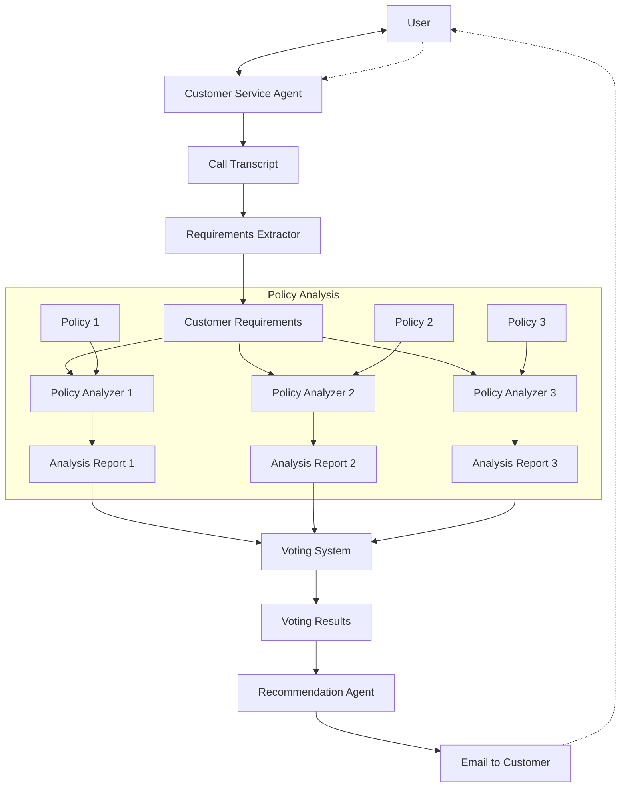

# System Patterns: Multi-Agent System for Insurance Policy Recommendations

## System Architecture

The system follows a multi-agent architecture with specialized components that work together to deliver personalized insurance recommendations:

## Key Technical Decisions

### 1. Multi-Agent Approach
- **Decision**: Implement a system of specialized agents rather than a single monolithic model.
- **Rationale**: Specialized agents can focus on specific tasks, improving performance and maintainability. This approach also enables the voting mechanism for more reliable recommendations.
- **Implementation**: Each agent is implemented as a separate module with clear interfaces.

### 2. LLM Selection
- **Decision**: Use Google Gemini as the primary LLM.
- **Rationale**: Gemini offers strong performance for natural language understanding and generation tasks.
- **Implementation**: Consistent API integration across all agent components.

### 3. Voting Mechanism
- **Decision**: Implement a consensus-based voting system with multiple parallel LLM calls.
- **Rationale**: Reduces individual model biases and increases recommendation reliability.
- **Implementation**: Multiple identical LLM instances analyze the same data independently, with results aggregated by a separate component.

### 4. Iterative Refinement
- **Decision**: Allow for conversation resumption and requirement updates.
- **Rationale**: Improves user experience by accommodating changing needs and follow-up questions.
- **Implementation**: Persistent conversation history and the ability to append new requirements.

## Design Patterns

### 1. Pipeline Pattern
The system implements a sequential processing pipeline where the output of each stage becomes the input for the next:
- Conversation → Transcript → Requirements → Analysis → Voting → Recommendation

### 2. Observer Pattern
The recommendation agent monitors voting results and triggers different actions based on the outcome:
- If clear consensus: Generate recommendation
- If slim margin: Initiate additional voting with refined criteria

### 3. Strategy Pattern
Different analysis strategies can be applied based on policy types and customer requirements:
- Different prompts and extraction techniques for different insurance categories
- Adaptable analysis depth based on complexity of requirements

### 4. Factory Pattern
Agent creation is handled by factory methods that configure the appropriate LLM settings:
- Consistent configuration across similar agent types
- Centralized management of model parameters

## Component Relationships

### Customer Service Agent
- **Inputs**: User queries and follow-up questions
- **Outputs**: Conversation transcript
- **Relationships**: Interacts directly with the user; provides data to the Requirements Extractor

### Requirements Extractor
- **Inputs**: Conversation transcript
- **Outputs**: Structured customer requirements
- **Relationships**: Receives data from CS Agent; provides requirements to Policy Analyzers

### Policy Analyzers
- **Inputs**: Customer requirements and insurance policy documents
- **Outputs**: Analysis reports highlighting relevant policy features
- **Relationships**: Receive requirements from Extractor; send reports to Voting System

### Voting System
- **Inputs**: Multiple analysis reports
- **Outputs**: Consolidated voting results
- **Relationships**: Receives reports from Analyzers; provides results to Recommendation Agent

### Recommendation Agent
- **Inputs**: Voting results
- **Outputs**: Final recommendation with justifications
- **Relationships**: Receives results from Voting System; delivers recommendations to the user

## Data Flow

1. User interacts with CS Agent → Generates transcript
2. Transcript processed by Extractor → Produces requirements
3. Requirements + Policies analyzed by Analyzers → Creates reports
4. Reports evaluated by Voting System → Produces voting results
5. Results processed by Recommendation Agent → Delivers final recommendation
6. (Optional) User provides feedback → Process repeats with updated requirements
