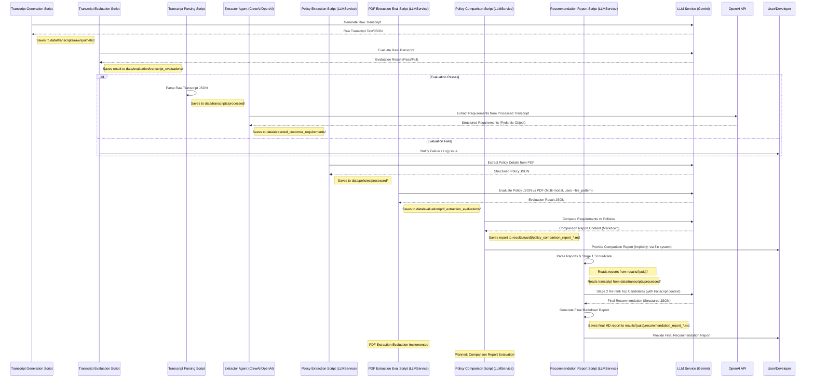

# System Patterns

## System Architecture

The project follows a workflow orchestrated by `scripts/orchestrate_scenario_evaluation.py`. This script manages data generation (parallel scenarios), processing (parallel transcript evaluation, sequential parsing/extraction), sequential report generation (per UUID), and final evaluation aggregation. A single agent (Extractor) is used within this workflow. The original multi-agent concept is not implemented.

```mermaid
graph TD
    subgraph "Orchestration (scripts/orchestrate_scenario_evaluation.py)"
        direction TB
        OrchStart[Start Orchestration] --> OrchGenT[1. Generate Transcripts <br>(Parallel Scenarios)]
        OrchGenT --> OrchEvalT[2a. Evaluate Transcripts <br>(Parallel Transcripts)]
        OrchEvalT --> OrchParseT[2b. Parse Transcripts <br>(Sequential Batch)]
        OrchParseT --> OrchExtractR[2c. Extract Requirements <br>(Sequential Batch)]
        OrchExtractR --> OrchGenReports[3. Generate Reports <br>(Sequential UUIDs)]
        OrchGenReports --> OrchFinalEval[4. Final Evaluation & Aggregation]
        OrchFinalEval --> OrchEnd[End Orchestration]
    end

    subgraph "Data Generation (Called by Orchestrator)"
        direction LR
        GenPersonalities[scripts/data_generation/generate_personalities.py] --> PersonalitiesJson[data/transcripts/personalities.json]
        CoverageReqs[data/coverage_requirements/coverage_requirements.py] --> GenTranscripts
        Scenarios[data/scenarios/*.json] --> GenTranscripts
        PersonalitiesJson --> GenTranscripts
        GenTranscripts[scripts/data_generation/generate_transcripts.py] --> RawTranscripts[data/transcripts/raw/synthetic/*.json]
    end

    subgraph "Transcript Processing & Extraction (Called by Orchestrator)"
        direction LR
        RawTranscripts --> EvalTranscripts[scripts/evaluation/transcript_evaluation/eval_transcript_main.py]
        EvalTranscripts -- Pass --> PassedUUIDs((Passed UUIDs))
        RawTranscripts --> ParseTranscripts[src/utils/transcript_processing.py]
        ParseTranscripts --> ProcessedTranscripts[data/transcripts/processed/*.json]
        ProcessedTranscripts --> ExtractorAgent[src/agents/extractor.py (CrewAI/OpenAI)]
        ExtractorAgent --> ExtractedReqs[data/extracted_customer_requirements/*.json]
    end

    subgraph "Policy Processing (Standalone)"
        direction LR
        RawPolicies[data/policies/raw/*.pdf] --> ExtractPolicyScript[scripts/extract_policy_tier.py (LLMService/Gemini)]
        ExtractPolicyScript --> ProcessedPolicies[data/policies/processed/*.json]
    end

    subgraph "Reporting & Analysis (Called by Orchestrator)"
        direction LR
        PassedUUIDs --> FilterLogicReport{Filter by Passed UUIDs}
        ExtractedReqs --> FilterLogicReport
        FilterLogicReport --> ComparisonScript[scripts/generate_policy_comparison.py (LLMService/Gemini)]
        ProcessedPolicies --> ComparisonScript
        ComparisonScript --> ComparisonReports[results/{uuid}/*.md]
        ProcessedTranscripts --> RecommendScript # Added dependency
        ComparisonReports --> RecommendScript[scripts/generate_recommendation_report.py (LLMService/Gemini)]
        RecommendScript --> FinalRecommendationMD[results/{uuid}/recommendation_report_{uuid}.md]
    end

    subgraph "Evaluation Focus"
        direction TB
        EvalTranscripts --> EvalTranscriptResults[data/evaluation/transcript_evaluations/*.json]
        ExtractPolicyScript --> EvalPdfExtraction[scripts/evaluation/pdf_extraction_evaluation/eval_pdf_extraction.py]
        RawPolicies --> EvalPdfExtraction
        EvalPdfExtraction --> EvalPdfResults[data/evaluation/pdf_extraction_evaluations/*.json]
        OrchFinalEval --> ScenarioEvalScript[scripts/evaluation/scenario_evaluation/evaluate_scenario_recommendations.py]
        ScenarioEvalScript --> ScenarioEvalResults[data/evaluation/scenario_evaluation/results_*.json]
        OrchFinalEval --> AggregatedResults[data/evaluation/scenario_evaluation/results_*_aggregated_*.json]
        ComparisonScript --> PlannedComparisonEval{Planned: Comparison Report Evaluation}
    end

    %% Orchestrator Flow Connections
    OrchGenT --> GenTranscripts
    GenTranscripts --> RawTranscripts
    RawTranscripts --> OrchEvalT
    OrchEvalT --> EvalTranscripts
    EvalTranscripts --> PassedUUIDs
    RawTranscripts --> OrchParseT
    OrchParseT --> ParseTranscripts
    ParseTranscripts --> ProcessedTranscripts
    ProcessedTranscripts --> OrchExtractR
    OrchExtractR --> ExtractorAgent
    ExtractorAgent --> ExtractedReqs
    PassedUUIDs --> OrchGenReports
    ExtractedReqs --> OrchGenReports
    ProcessedPolicies --> OrchGenReports
    OrchGenReports --> ComparisonScript
    ComparisonScript --> ComparisonReports
    ComparisonReports --> RecommendScript
    RecommendScript --> FinalRecommendationMD
    FinalRecommendationMD --> OrchFinalEval
    OrchFinalEval --> ScenarioEvalScript
    ScenarioEvalScript --> ScenarioEvalResults
    ScenarioEvalResults --> OrchFinalEval # Implies reading latest result
    OrchEnd --> User[User/Developer]

    %% Other Connections
    Policy Processing --> ProcessedPolicies
    RawPolicies --> EvalPdfExtraction
    ExtractPolicyScript --> EvalPdfExtraction
    ExtractedReqs --> FutureML{Future: ML Models}

```

## Key Technical Decisions

1.  **Script-Driven Workflow**:
    *   Decision: Implement core logic (data generation, policy extraction, comparison) as standalone Python scripts.
    *   Rationale: Allows for modular development and testing of individual components before full agent integration. Enables batch processing.
    *   Implementation: Various scripts in `scripts/` directory (e.g., `generate_transcripts.py`, `extract_policy_tier.py`, `generate_policy_comparison.py`).

2.  **Single Agent Implementation (Extractor)**:
    *   Decision: Implement the Extractor using the `crewai` framework with OpenAI.
    *   Rationale: Leverages existing agent framework for a specific, well-defined task (requirement extraction). Allows experimentation with agent-based approaches.
    *   Implementation: `src/agents/extractor.py`.

3.  **Centralized LLM Service (Gemini)**:
    *   Decision: Create a reusable service (`LLMService`) for interacting with Google Gemini.
    *   Rationale: Standardizes API calls, configuration, error handling, and retry logic for most LLM tasks.
    *   Implementation: `src/models/llm_service.py` used by most scripts. Note: Extractor agent uses OpenAI directly via `crewai`.

4.  **Emphasis on Evaluation**:
    *   Decision: Integrate evaluation steps at key points in the workflow.
    *   Rationale: Ensures data quality and component performance before proceeding to downstream tasks. Provides metrics for improvement.
    *   Implementation: Dedicated evaluation scripts for transcripts, PDF extraction, and scenario recommendations. Planned evaluation for comparison reports.

5.  **Structured Knowledge Representation**:
    *   Decision: Transform unstructured policy documents and conversations into structured data using Pydantic models.
    *   Rationale: Enables systematic comparison, analysis, and validation.
    *   Implementation: Pydantic models (`TravelInsuranceRequirement`, policy extraction models) for validated JSON outputs.

6.  **Hybrid Approach (Planned)**:
    *   Decision: Combine LLM-based reasoning with traditional ML (Future Goal).
    *   Rationale: Leverages strengths of both approaches (LLM for reasoning, ML for pattern recognition).
    *   Implementation: LLMs used in scripts/agent. Supervised ML for insights is planned for a later phase.

## Design Patterns

1.  **Pipeline Pattern**:
    *   Sequential processing of data through specialized scripts/stages (e.g., Generation -> Evaluation -> Parsing -> Extraction).
    *   Each stage transforms or enriches the data.
    *   Implementation: Current script execution order forms pipelines.

2.  **Agent Pattern**:
    *   Used for the Extractor Agent (`src/agents/extractor.py`).
    *   A specialized entity with specific responsibilities.
    *   Implementation: Managed by `crewai` framework.

3.  **Service Layer Pattern**:
    *   The `LLMService` acts as a service layer abstracting direct Gemini API calls.
    *   Provides a consistent interface for LLM interactions.
    *   Implementation: `src/models/llm_service.py`.

4.  **Composite Pattern**:
    *   Complex customer requirements and policy details composed of simpler components.
    *   Hierarchical organization of data.
    *   Implementation: Nested JSON structures validated by Pydantic models.

## Component Relationships

### LLM Service (`src/models/llm_service.py`)
- **Purpose**: Centralized interface for Google Gemini API calls.
- **Inputs**: Prompts, parameters (model, tokens, etc.), content (text/multi-modal).
- **Outputs**: Generated content (text, structured JSON).
- **Dependencies**: Google Gemini API, `src/models/gemini_config.py`.
- **Consumers**: `scripts/extract_policy_tier.py`, `scripts/generate_policy_comparison.py`, `scripts/data_generation/*`, `scripts/evaluation/*`.

### Transcript Generation (`scripts/data_generation/generate_transcripts.py`)
- **Purpose**: Generates synthetic transcripts based on scenarios, requirements, and personalities.
- **Inputs**: `data/scenarios/*.json`, `data/coverage_requirements/coverage_requirements.py`, `data/transcripts/personalities.json`.
- **Outputs**: Raw transcript JSON files (`data/transcripts/raw/synthetic/*.json`).
- **Dependencies**: `LLMService`.

### Transcript Parsing (`src/utils/transcript_processing.py`)
- **Purpose**: Parses evaluated raw transcripts into a simpler list format. Defines `TravelInsuranceRequirement` model.
- **Inputs**: Raw transcript JSON (`data/transcripts/raw/synthetic/*.json`).
- **Outputs**: Processed transcript JSON (`data/transcripts/processed/*.json`).
- **Dependencies**: None (when run for parsing).

### Extractor Agent (`src/agents/extractor.py`)
- **Purpose**: Extracts structured customer requirements from processed transcripts.
- **Inputs**: Processed transcript JSON (`data/transcripts/processed/*.json`).
- **Outputs**: Extracted requirements JSON (`data/extracted_customer_requirements/*.json`) conforming to `TravelInsuranceRequirement`.
- **Dependencies**: `crewai` framework, OpenAI API (via `.env`), `src/utils/transcript_processing.py` (for model definition).

### Policy Extraction Script (`scripts/extract_policy_tier.py`)
- **Purpose**: Extracts structured policy details from raw PDFs.
- **Inputs**: Raw policy PDFs (`data/policies/raw/*.pdf`).
- **Outputs**: Processed policy JSON (`data/policies/processed/*.json`) with detailed structure (base/conditional limits, source details).
- **Dependencies**: `LLMService`, Pydantic models defined within the script.

### Policy Comparison Script (`scripts/generate_policy_comparison.py`)
- **Purpose**: Generates Markdown reports comparing extracted requirements against processed policies at the insurer level.
- **Inputs**: Extracted requirements JSON (`data/extracted_customer_requirements/*.json`), Processed policy JSON (`data/policies/processed/*.json`), `data/policies/pricing_tiers/tier_rankings.py`.
- **Outputs**: Markdown comparison reports (`results/{uuid}/*.md`).
- **Dependencies**: `LLMService`, Extractor Agent output, Policy Extraction Script output.

### Recommendation Report Script (`scripts/generate_recommendation_report.py`)
- **Purpose**: Parses comparison reports, performs Stage 1 scoring, calls LLM for Stage 2 re-ranking (using transcript context), generates a final Markdown report, and saves it.
- **Inputs**:
    - Markdown comparison reports (`results/{uuid}/*.md`).
    - Processed transcript JSON (`data/transcripts/processed/parsed_transcript_*_{uuid}.json`).
- **Outputs**: Final recommendation Markdown report (`results/{uuid}/recommendation_report_{uuid}.md`).
- **Dependencies**: `LLMService`, Comparison Report Script output, Processed Transcript data, Pydantic (`FinalRecommendation` model).

### ML Models (Future)
- **Purpose**: Uncover insights from data.
- **Inputs**: Extracted requirements JSON, potentially comparison results or final recommendations.
- **Outputs**: Insights on feature importance, product positioning.
- **Dependencies**: Extractor Agent output, potentially other data sources.

### Evaluation Components

#### Transcript Evaluation
-   **Purpose**: To evaluate the quality, relevance, and coverage of synthetically generated raw transcripts (`data/transcripts/raw/synthetic/*.json`) against the intended scenario and coverage requirements before they are used for requirement extraction. Acts as a quality gate.
-   **Scripts**: Primarily `scripts/evaluation/transcript_evaluation/eval_transcript_main.py`, which orchestrates helpers in the same directory (`eval_transcript_parser.py`, `eval_transcript_prompts.py`, `eval_transcript_gemini.py`, `eval_transcript_results.py`, `eval_transcript_utils.py`).
-   **Inputs**:
    -   Raw Transcript JSON: `data/transcripts/raw/synthetic/transcript_{scenario}_{uuid}.json`.
    -   Coverage Requirements: `data/coverage_requirements/coverage_requirements.py`.
    -   Scenario Definitions: `data/scenarios/{scenario}.json` (used to provide context).
-   **Workflow**:
    1.  Parses the raw transcript JSON.
    2.  Extracts the scenario name from the transcript filename or content.
    3.  Loads the corresponding scenario definition and coverage requirements.
    4.  Constructs a detailed prompt (`eval_transcript_prompts.py`) instructing the LLM to assess the transcript based on criteria like requirement coverage, scenario relevance, realism, and conversational flow.
    5.  Calls the LLM (`eval_transcript_gemini.py` via `LLMService`) to perform the evaluation.
    6.  The LLM is expected to return a structured JSON response (defined by Pydantic models like `TranscriptEvaluation`, `EvaluationSummary`, `CoverageEvaluation`).
    7.  Saves the structured evaluation results to `data/evaluation/transcript_evaluations/transcript_eval_{scenario}_{uuid}.json`.
-   **Evaluation Logic**: Relies on the LLM's assessment based on the provided prompt and criteria. The structured output includes scores and justifications for different aspects of the transcript quality. A simple "PASS"/"FAIL" might be inferred based on thresholds (though this threshold logic isn't explicitly in the script currently, the detailed JSON output allows for it).
-   **Dependencies**: `LLMService`, Scenario Definitions, Coverage Requirements.

#### PDF Extraction Evaluation
-   **Purpose**: To evaluate the accuracy and completeness of the structured policy data extracted by `scripts/extract_policy_tier.py` by comparing the processed JSON (`data/policies/processed/*.json`) against the original source PDF (`data/policies/raw/*.pdf`).
-   **Script**: `scripts/evaluation/pdf_extraction_evaluation/eval_pdf_extraction.py`
-   **Inputs**:
    -   Processed Policy JSON: `data/policies/processed/{insurer}_{tier}.json`. Can be filtered using `--file_pattern`.
    -   Raw Policy PDF: `data/policies/raw/{insurer}_{tier}.pdf` (path inferred from JSON filename).
-   **Workflow**:
    1.  Iterates through specified processed policy JSON files.
    2.  For each JSON, finds the corresponding raw PDF.
    3.  Constructs multi-modal prompts for the LLM, asking it to perform two-way verification:
        *   Verify JSON content against the PDF.
        *   Verify PDF content against the JSON.
    4.  Calls the LLM (`LLMService`, using a multi-modal model like Gemini Pro Vision) with both the text prompt and the PDF image/content.
    5.  The LLM returns a structured JSON evaluation result assessing consistency, accuracy, and completeness.
    6.  Saves the evaluation results to `data/evaluation/pdf_extraction_evaluations/eval_{insurer}_{tier}.json`.
-   **Evaluation Logic**: Relies on the multi-modal LLM's ability to compare the structured text data (JSON) with the visual and textual content of the PDF document based on the verification prompts.
-   **Dependencies**: `LLMService` (multi-modal model), Processed Policy JSON, Raw Policy PDF.

#### Scenario Recommendation Evaluation
-   **Purpose**: To evaluate the final recommendation generated by `scripts/generate_recommendation_report.py` against a predefined ground truth for specific test scenarios. This verifies if the system recommends an appropriate policy given the scenario's constraints and expected outcomes.
-   **Script**: `scripts/evaluation/scenario_evaluation/evaluate_scenario_recommendations.py`
-   **Inputs**:
    -   Ground Truth: `data/evaluation/scenario_evaluation/scenario_ground_truth.json` (defines `status` like `"full_cover_available"` or `"partial_cover_only"` and a list of `expected_policies` with `insurer`, `tier`, `justification` for each scenario key).
    -   Recommendation Reports: `results/{uuid}/recommendation_report_*.md` (output from `generate_recommendation_report.py`).
    -   Transcripts: `data/transcripts/raw/synthetic/transcript_{scenario}_{uuid}.json` (used only when evaluating all scenarios to link UUIDs back to scenario names).
-   **Workflow**:
    1.  Identifies target UUIDs either via the `--scenario` argument (filtering transcripts) or by iterating through all `results/{uuid}` directories and finding the corresponding scenario from transcript filenames.
    2.  Loads the ground truth entry for the relevant scenario(s).
    3.  For each targeted UUID, finds the corresponding recommendation report (`recommendation_report_*.md`).
    4.  Parses the recommended policy from the report.
    5.  Compares the parsed policy against the ground truth.
    6.  Outputs results to console and optionally to a JSON file (defaulting to `data/evaluation/scenario_evaluation/results_{scenario}_{timestamp}.json`).
-   **Parsing Logic & Pattern Enforcement**:
    -   The script uses a specific regular expression (`r"\*\*([a-zA-Z\s]+)\s*-\s*([a-zA-Z\s!]+)\*\*"`) within the `parse_recommendation_report` function to extract the recommended policy.
    -   This regex strictly expects the format `**INSURER - Tier**`. It captures the insurer name *before* the hyphen and the tier name *after* it.
    -   This parsing is reliable because the report generation script (`scripts/generate_recommendation_report.py`) explicitly creates this exact pattern in the final report using the line: `f"\n**{stage2_recommendation.recommended_insurer.upper()} - {stage2_recommendation.recommended_tier}**\n"`.
-   **Evaluation Logic (`evaluate_recommendation` function)**:
    1.  Takes the parsed recommended insurer/tier (converted to lowercase) and the ground truth entry for the scenario.
    2.  Checks the ground truth `status` (`"full_cover_available"` or `"partial_cover_only"`).
    3.  Compares the recommended policy against each entry in the ground truth's `expected_policies` list.
    4.  Assigns a result based on the match and the status:
        -   `status="full_cover_available"` & Match -> `"PASS"`
        -   `status="full_cover_available"` & No Match -> `"FAIL"`
        -   `status="partial_cover_only"` & Match -> `"PASS (Partial Cover)"` (Recommended an acceptable partial solution)
        -   `status="partial_cover_only"` & No Match -> `"FAIL (Partial)"` (Failed to recommend even an acceptable partial solution)
-   **Dependencies**: Ground Truth JSON, Recommendation Reports, Raw Transcripts (for scenario mapping).

## Data Flow



## Error Handling and Resilience

1.  **Input Validation**:
    *   Scripts often validate input paths and file formats.
    *   Pydantic models enforce schema validation for structured JSON outputs (Extractor, Policy Extraction).
    *   `LLMService` includes robustness checks for JSON parsing.

2.  **Fallback Mechanisms**:
    *   Some scripts include basic fallbacks (e.g., saving raw text if JSON parsing fails during transcript generation).
    *   `LLMService` implements retry logic for API calls.

3.  **Logging**:
    *   Some scripts incorporate logging for debugging (e.g., transcript generation prompt).

4.  **Evaluation Gates**:
    *   Transcript evaluation acts as a quality gate before extraction.
    *   Planned evaluations will add further checks.
